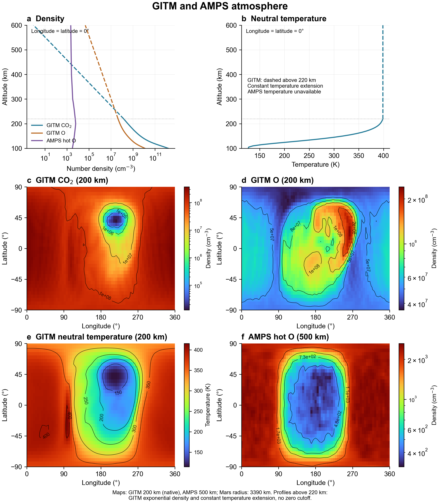

# MarsTP 示例

## GITM 与 AMPS 大气剖面及分布图



该图使用 `data/gitm_sph.mat` 和 `data/amps_sph.mat`，展示 GITM 中性大气与 AMPS 热氧的高度剖面及经纬度分布。六个面板按从左到右、从上到下的顺序排列：

| 面板 | 内容 |
|---|---|
| (a) | 经度和纬度均为 0° 处，GITM CO₂、O 和 AMPS 热 O 的数密度高度剖面 |
| (b) | 同一位置的 GITM 中性温度高度剖面 |
| (c) | 高度 200 km 处的 GITM CO₂ 数密度分布 |
| (d) | 高度 200 km 处的 GITM O 数密度分布 |
| (e) | 高度 200 km 处的 GITM 中性温度分布 |
| (f) | 高度 500 km 处的 AMPS 热 O 数密度分布 |

数密度单位为 cm⁻³，温度单位为 K；高度为离地高度，采用火星半径 3390 km。分布图采用独立色标和黑色标注等值线，数密度使用对数色标，温度使用线性色标。经纬度沿用输入数据定义。

剖面显示 100 至 600 km。GITM 原始数据仅覆盖 100 至 220 km，220 km 以上的虚线为恒温、恒重力条件下的指数密度延伸，温度保持不变；绘图移除了原处方在 20 个标高处的密度截断。200 km 的 GITM 分布和 500 km 的 AMPS 分布均取自原始高度层。AMPS 仅提供热 O 数密度，不提供温度。

在仓库根目录运行：

```sh
python examples/plot_atmosphere.py
```

需要 NumPy、SciPy、Matplotlib 和 Arial 字体。图片输出到本目录，重新运行会覆盖同名输出。完整方法、数据说明和检查项目见 [大气示例说明](atmosphere.md)。

## 800 km O₂⁺ 轨迹与电场做功


这两个示例使用相同的球面随机释放方向，模拟 1000 个初始静止 O₂⁺。图 1 用无图例的 3×2 六面板展示轨迹的 XZ 和 YZ 投影，图 2 在 XZ 投影上展示各电场分量沿轨迹的累计做功。Julia 负责积分和做功分析，Python 使用 `py_space_zc.maven.bs_mpb`、`plot_mars` 和 Matplotlib 绘图。

## 文件

图 1 的详细说明与复现命令见 [XZ 与 YZ 的 3×2 轨迹对照图](trajectories_xz_yz.md)。

| 文件 | 用途 |
|---|---|
| [sphere_trajectories.jl](sphere_trajectories.jl) | 轨迹积分和边界终止 |
| [plot_sphere_trajectories.py](plot_sphere_trajectories.py) | 可选的旧版 XZ 三面板绘图，输出 `trajectories_xz_legacy.png` |
| [plot_trajectories_xz_yz.py](plot_trajectories_xz_yz.py) | 全部、向阳面、背阳面的 XZ/YZ 六个面板 |
| [hemisphere_work.jl](hemisphere_work.jl) | 逐粒子做功分析和能量闭合检查 |
| [plot_hemisphere_work.py](plot_hemisphere_work.py) | 日夜两侧、三个电场分量的 2×3 面板 |

图 1 和图 2 的 Python 入口分别为 `plot_trajectories_xz_yz.py` 和 `plot_hemisphere_work.py`，均调用本目录中的 Julia 文件，不依赖仓库 `scripts/` 目录。轨迹通过标准输出传入 Python 内存，不保存轨迹数据文件；仅保存 PNG 图片。每次重新绘图会重新积分。

## 初始条件和边界

| 参数 | 本次图片使用的值 |
|---|---|
| 粒子 | O₂⁺，质量与电荷取自 TestParticle 的 `SpeciesDict` |
| 释放高度 | 800 km |
| 初始速度 | 三个笛卡尔分量均为 0 m/s |
| 粒子数 | 1000，按初始 X 分为向阳面 500 个、背阳面 500 个 |
| 球面采样 | `cos(theta)` 与方位角分别均匀采样 |
| 随机数 | `Xoshiro(20260905)` |
| 火星半径 | MarsTP 的 `Rm = 3390 km` |
| 终止边界 | 高度 200 km 的内球面，或火心距离 `4 Rm` 的外球面 |
| 时间保护上限 | 20,000 s；达到上限不视为触边 |
| 积分 | TestParticle Boris，基准步长 0.1 s，4 个 Julia 线程 |
| 场 | 静态 `E_Total [V/m]` 和 `B_Field [T]` |

这些示例采用非相对论洛伦兹力模型，不包含碰撞、重力、化学生成权重或粒子反馈。XZ 面板中的 BS 和 MPB 是 `py_space_zc` 画出的参考曲线，不是积分终止边界。XZ 投影包含所有 Y 位置，YZ 投影包含所有 X 位置，均为完整三维轨迹的投影；轨迹投影进入火星圆盘不代表实际粒子进入火星。

## 环境与输入数据

1. 安装与项目兼容的 Julia，并让 `julia` 位于 PATH。生成这两张图片时使用 Julia 1.12.6 和仓库的 `Manifest.toml`。
2. 在仓库根目录执行 `julia --project=. -e "using Pkg; Pkg.instantiate()"`，准备 Julia 依赖。
3. Python 需要 NumPy、Matplotlib，以及提供 `maven.bs_mpb`、`maven.plot_mars` 和火星贴图的 **Chi Zhang 自定义 `py_space_zc` 库**。这个库不包含在本仓库中，不能假设任意同名包都提供相同接口。安装并配置它后再运行绘图入口。
4. 系统需要 Arial 字体。
5. 将场文件放在 `data/mars_fields_spherical_from_dat.vts`。该大文件不上传 GitHub。必须包含 `B_Field [T]`、`E_Total [V/m]`、`E_conv [V/m]` 和 `E_hall [V/m]`，且网格与 MarsTP 数据读取约定一致。仅凭图片无法复现原始场。

这些示例只读取电磁场，不使用 AMPS、GITM 或源项 MAT 文件。它们也不自动安装任何依赖。

## 运行

在仓库根目录，用已配置 `py_space_zc` 的 Python 运行：

```sh
python examples/plot_trajectories_xz_yz.py
python examples/plot_hemisphere_work.py
```

默认输出为本目录 `images/` 下的两个 PNG，重新运行会更新对应图片。如果希望保留已有图片，先设置输出路径，例如 Windows PowerShell：

```powershell
$env:TRAJECTORY_PREVIEW = "$PWD/trajectory_preview.png"
$env:HEMISPHERE_WORK_PREVIEW = "$PWD/work_preview.png"
python examples/plot_trajectories_xz_yz.py
python examples/plot_hemisphere_work.py
```

轨迹示例还支持 `RELEASE_ALTITUDE_KM`、`PARTICLE_COUNT`、`TRACE_DT` 和 `TRACE_LIMIT` 环境变量，默认分别为 800、1000、0.1、20000。做功示例固定为本文的 800 km、1000 粒子配置，以确保与图片对应。做功绘图入口会设置 `WORK_HEMISPHERE=all`，Julia 单独运行时默认只分析向阳面。

## 图 1：无图例的 XZ/YZ 六面板轨迹


图按 **3 行、2 列**排列，第一列为 XZ 投影，第二列为 YZ 投影。第一行为全部粒子（`All O2+`），第二行为向阳面粒子（`Dayside O2+`），第三行为背阳面粒子（`Nightside O2+`）。六个面板使用相同坐标尺度和等比例坐标轴，位置以火星半径 `Rm = 3390 km` 归一化。图中不显示主标题、底部图例或底部说明文字。

分组依据**起始位置**：向阳面为 `X0 > 0`，背阳面为 `X0 <= 0`。每行两列显示同一批粒子的完整轨迹，粒子随后跨过日夜分界面不会改变所属分组。蓝色表示到达外边界，橙色表示返回内边界；深色小点表示释放位置，细灰圆表示 800 km 释放球面的投影轮廓。

XZ 列绘制火星贴图、BS 虚线和 MPB 点线；YZ 列绘制火星几何圆盘，不绘制 BS/MPB 参考曲线。绘图代码见 [plot_trajectories_xz_yz.py](plot_trajectories_xz_yz.py)，完整说明见 [XZ/YZ 说明](trajectories_xz_yz.md)。

| 分组 | 到达外边界 | 返回内边界 |
|---|---:|---:|
| 全部 | 736 | 264 |
| 向阳面 | 453 | 47 |
| 背阳面 | 283 | 217 |

本次所有粒子均触边，最长飞行时间约 4148.53 s。轨迹图使用积分末步线段与球面的交点作为边界终点。记录并绘制的点有抽稀，但积分步长保持 0.1 s。

## 图 2：日夜两侧累计电场做功


第一行向阳面，第二行背阳面；三列依次是对流电场、Hall 电场和总电场做功。调用核心函数 `field_work_profile(sol, itp)`，对同一条由总电场驱动的轨迹计算：

$$W_i(t)=q\int_{t_0}^{t}\mathbf{E}_i[\mathbf{x}(t')]\cdot\mathbf{v}(t')\,dt'.$$

颜色表示从释放时刻到当前位置的**累计带符号做功**，不是该位置的瞬时功率。红色表示净增能，蓝色表示净减能，单位 keV。第三列直接积分 `E_Total`，不是用动能替代。`field_work_profile` 也返回瞬时功率和能量闭合残差，详见根目录 README 和函数 docstring。

每行三列共用一套对称对数色标，线性区阈值为 0.1 keV。上下两行独立取各自所有分量的最大绝对累计做功作为 clim：本次向阳面约 ±17.5032 keV，背阳面约 ±17.3483 keV。因此跨行比较时要同时读取色标。

做功在每个保存的积分步上采用中点求积，仅绘图时抽稀。停止于场域内最后一个有效状态，不在外推点计算电场。检查 `ΔK - W_total`；若其绝对值除以 `max(abs(ΔK), 1 eV)` 大于 0.1%，自动依次尝试 0.05、0.025、0.0125 s 步长，仍不满足则报错。本次最大相对残差：向阳面约 0.0869%，背阳面约 0.0520%。能量闭合良好不等同于完整的轨迹收敛验证。

做功分解不能直接预测删除某一电场分量后的粒子能量，因为那样也会改变轨迹。均匀、零速度球面释放的轨迹数不是按真实源项加权的粒子通量。

## 验证

```sh
julia --threads=2 --project=. test/runtests.jl
```

核心做功测试覆盖笛卡尔坐标一致性、正负做功、反向时间、单粒子和多粒子输入、并行结果、非法数据，以及均匀电场中的能量闭合。示例运行时另外检查粒子数量、有限值、边界终止或能量残差。
