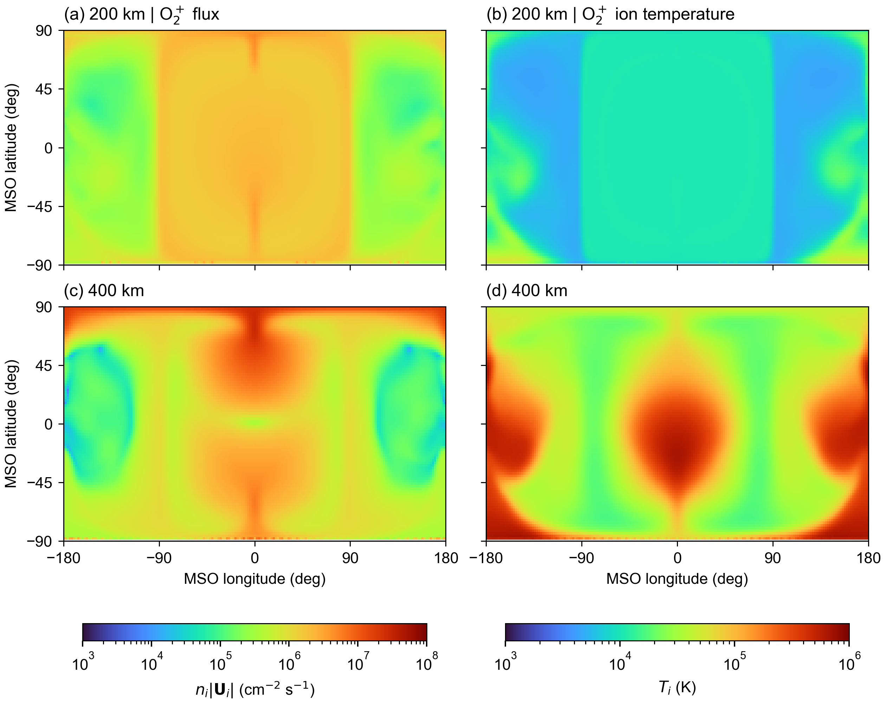

# MHD O₂⁺ 通量与离子温度分布



## 图示内容

两行分别为离地 200、400 km，左列为 O₂⁺ 标量通量 `n*norm(Ui)`（cm⁻² s⁻¹），右列为离子温度 Ti（K）。火星半径为 3390 km，采用 MSO 球坐标角度，纬度为 90° 减余纬，方位角为 atan2(y,x)，不是火星地理经纬度。

通量按三维体速度大小计算，不取径向分量、不裁剪负径向速度。它不是穿过球面的净法向通量，也不包含额外的热通量。计算时先插值 n、Ti 和三个笛卡尔 Ui 分量，再计算 n*norm(Ui)，最后从 m⁻² s⁻¹ 转为 cm⁻² s⁻¹。

每列两个高度共用对数色标，使用 turbo、Arial 字体。版面为 183×145 mm。PNG 为 350 dpi；PDF/SVG 保留可编辑文字，分布图以 600 dpi 栅格层保存。没有底部说明段落。

## 文件

- `sample_ionosphere_maps.jl`：调用 MarsTP 的电离层矩插值接口，采样 200、400 km 球面。
- `plot_ionosphere_maps.py`：调用同目录 Julia 脚本，验证采样结果，生成 2×2 图。
- `images/flux_Ti_200_400km.png`、`.pdf`、`.svg`：本次输出。

## 复现

在仓库根目录运行：

```sh
python examples/background_models/plot_ionosphere_maps.py
```

复用已有采样结果，只重绘：

```sh
python examples/background_models/plot_ionosphere_maps.py outputs/ionosphere_maps_<timestamp>
```

指定目录必须包含本示例生成的 `source.csv`。无参数运行会创建新的输出目录，保存源数据 CSV、运行日志和 metadata.json。图片统一写到 `examples/background_models/images/`，重新运行会更新同名图片。完整采样数据保留在本地 outputs，未随示例上传。

需要与项目兼容的 Julia（本次 1.12.6、TestParticle 0.23.3），使用项目 Manifest.toml；Python 需要 NumPy、Matplotlib 和 Arial 字体。该图不依赖 py_space_zc，不自动安装任何依赖。

原始输入为 `data/mars_fields_spherical_from_dat.vts`，大文件不上传 GitHub。必须包含 O₂⁺ 的 `n_O^2^p [m^-3]`、`T_O^2^p [K]` 和 `U_O^2^p [m/s]`，并符合 MarsTP 的网格约定。代码使用与 backtracing 相同的 `load_ionosphere_source` 和 `ionosphere_properties`，不使用 MAT 出流率。

## 采样与数据检查

采样范围为经度 −180° 至 180°、纬度 −90° 至 90°，间隔均为 2°，每个高度 91×181 个采样点。采用球网格线性插值，速度分量按笛卡尔标量分别插值。200 km 边界向网格内部偏移 1e-8 m，仅用于避免浮点舍入造成域外查询。

已核对 32942 条记录的数量、有限性、温度正值、通量非负及 `flux=n*sqrt(ux²+uy²+uz²)` 的一致性。

南极点（纬度 −90°）出现约 1e-10 K 的异常温度及零速率。绘图将整个南极采样行标灰，并排除该行对色标范围的影响，不填补、不修复原始数据。400 km 数据中有 91 个零通量采样点，均在该行。原始异常数值完整保留于 source.csv 和元数据范围统计中。此处理仅作用于绘图，**不会修复 backtracing 中的 MHD 极点数据**。科学分析前仍需核实原始网格极点的生成方式。

PNG 已进行视觉检查；同列色标分别覆盖未屏蔽数据，不作百分位截断。

## 配套 backtracing 更新

`BacktraceConfig(ionosphere_altitude_km=400.0)` 设置一层可穿越的面源，内边界始终为 200 km。每次横穿贡献 `F*g/abs(v dot er)`，其中 `F=n*norm(Ui)`，`g` 为归一化 MHD 漂移麦氏分布。穿层后继续累计体积源。该模型取代此前电离层处终止的边界 VDF 模型。

通量和温度图本身不受输运模型调整影响。公式、单位、完整推导及模型限制见 [backtracing 推导](../backward_tracing/backtracing_derivation.md)。
