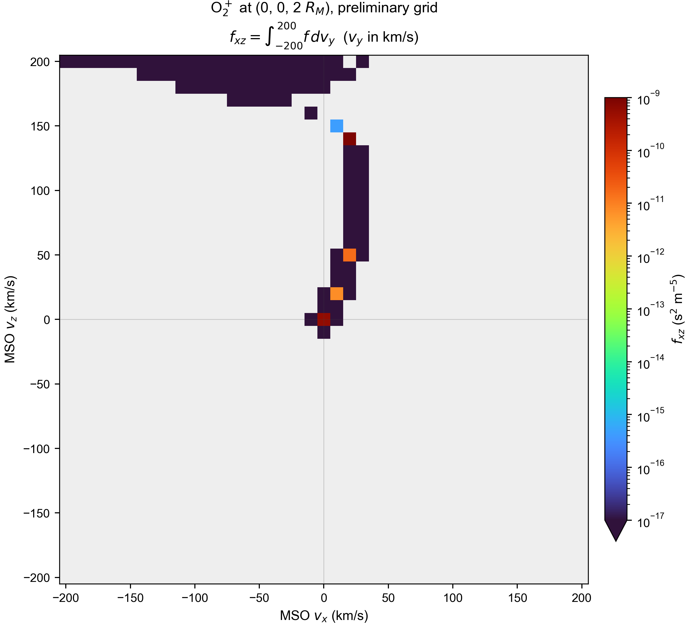

# Backward tracing

本目录包含固定探头反向轨迹、薄层面源推导及对 Vy 积分的二维 VDF。示例使用火星半径 3390 km；所有命令从仓库根目录运行。

## 1. 随机速度的反向轨迹


探头位于 `(0,0,2 Rm)`，5000 个初始速率在 10 至 200 km/s 均匀采样，初始 Vy=0，方向在 XZ 平面均匀采样。这张图仅展示路径，不代表按物理源项加权的 VDF。

```sh
python examples/backward_tracing/plot_probe_backtrace.py
```

入口调用 [random_probe_backtrace.jl](random_probe_backtrace.jl)。已有轨迹可以用 `--data outputs/<run_id>/trajectories.jsonl` 重绘。详细条件和依赖见 [轨迹说明](probe_backtrace.md)。

## 2. 面源和相空间密度推导

[完整推导与单位](backtracing_derivation.md) 对应 400 km 可穿越薄层面源与固定 200 km 内边界。每次穿层累计 `F*g/abs(v dot er)`，穿层后继续积分体积源。核心实现位于仓库 `src/tracing/back_tracing.jl`，MHD 读取位于 `src/data/mhd.jl`。

## 3. Vy 积分的二维速度分布，尚未收敛



这是 `f_xz=integral f dVy`，单位 s² m⁻⁵，与 Vy=0 切片不同。首轮网格共 35301 条轨迹，**速度网格和时间步长检查未收敛，不能用于定量科学结论**。详细设置与检查见 [初步 VDF 说明](vdf_preliminary.md)。

重绘随示例保留的数值数据：

```sh
python examples/backward_tracing/plot_probe_vdf.py
```

`data/` 保存首轮 `vdf.csv`、五个检查点、步长/速度间隔检查结果和绘图元数据。原始 JLD2 和运行日志仍保留于本地 outputs。

重新计算（约 35301 条轨迹），请为每次运行使用新的输出目录：

```sh
julia --startup-file=no --threads=4 --project=. examples/backward_tracing/probe_vdf_integrated.jl outputs/probe_vdf_new_run
python examples/backward_tracing/plot_probe_vdf.py outputs/probe_vdf_new_run
```

检查脚本 [check_probe_vdf_grid.jl](check_probe_vdf_grid.jl) 读取指定输出目录的 `qa_points.csv`，计算高值点在不同 Vy 和时间步长下的结果；随示例的数据目录提供本轮检查点。该脚本依赖同样的 MHD、MAT 体积源及 GITM 输入。

## 依赖

Julia 使用项目环境。随机轨迹绘图需 Chi Zhang 自定义 py_space_zc（bs_mpb、plot_mars 及火星贴图）、NumPy、Matplotlib、Arial；VDF 绘图只需 NumPy、Matplotlib、Arial。物理运行需仓库 data 中的相应输入，不自动下载或安装。

返回 [示例总目录](../README.md)。
