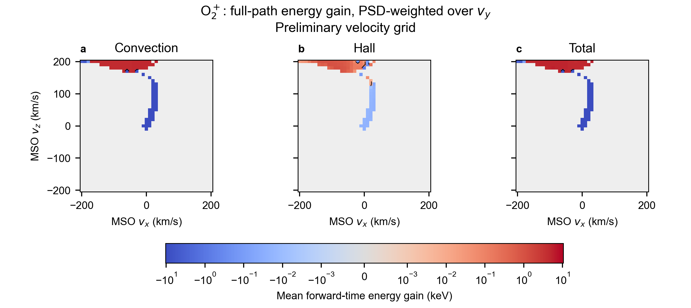

# Backtraced electric energy gain

The diagnostic follows each detector velocity through the **total-field trajectory**. It accumulates convection, Hall and total electric work on that same path. This is an additive work decomposition, not a comparison of trajectories evolved under separate fields.

## Physical sign and SI units

Let the detector time be t0=0 and the backtrace endpoint be tb<0. For j=convection, Hall or total,

```math
\Delta K_j = \int_{t_b}^{t_0} q\mathbf E_j\cdot\mathbf v\,dt
           = -\int_{t_0}^{t_b} q\mathbf E_j\cdot\mathbf v\,dt.
```

Positive means net energy gain on the physical forward path; negative means net energy loss. Backtracing uses negative dt and the physical velocity, without manually reversing charge or velocity. For accepted decreasing-time steps the code accumulates `-q*dot(E_mid,v_mid)*dt/e`, in eV. E is Cartesian V/m, v Cartesian m/s, q C, dt s, and e=1.602176634e-19 J/eV. Synchronized endpoint velocities are averaged for midpoint quadrature, including partial boundary steps and source-shell splits.

```math
\Delta K_{\rm total} \simeq \frac{m}{2}(v_0^2-v_b^2),\qquad
\Delta K_{\rm total} \simeq \Delta K_{\rm conv}+\Delta K_{\rm Hall}.
```

These equalities are checked numerically. Magnetic force does no direct work. The quantity is an energy difference, not acceleration in m/s²; a positive final difference does not imply acceleration everywhere along the path.

## Which path and which 2D average?

The path ends at the fixed 200 km absorption boundary, outer field boundary, or 500 s limit. The 400 km source shell is penetrable. **Full-path work starts at that backtrace endpoint**, even if the source contribution occurs later along the physical path. It must not be interpreted as the energy acquired since particle production. A birth-to-detector diagnostic would weight the remaining work separately at every volume-source location and sheet crossing.

For a 2D pixel the displayed mean is

```math
\overline{\Delta K_j}(v_x,v_z)=
\frac{\int f(v_x,v_y,v_z)\Delta K_j(v_x,v_y,v_z)\,dv_y}
     {\int f(v_x,v_y,v_z)\,dv_y}.
```

The same finite Vy rectangle quadrature as the existing VDF is used. The numerator has units eV s² m⁻⁵ and the denominator s² m⁻⁵; the mean is eV. Zero-PSD pixels are undefined (NaN), not zero work. This is neither an unweighted average nor an integral of energy alone. Each 3D velocity point is retained independently, including points with zero source weight.

## Run and outputs

From the repository root, with the existing project dependencies and field/source inputs:

```sh
julia --startup-file=no --compiled-modules=existing --threads=4 --project=. examples/backward_tracing/probe_energy_gain.jl outputs/energy_new_run
python examples/backward_tracing/plot_energy_gain.py outputs/energy_new_run
julia --startup-file=no --compiled-modules=existing --project=. examples/backward_tracing/check_energy_gain.jl outputs/energy_checks_new_run
```

Append `smoke` to the first command for 27 trajectories. The full grid has 41×21×41=35301 trajectories, vx/vz spacing 10 km/s, Vy spacing 20 km/s, all components spanning -200 to 200 km/s. Detector=(0,0,2 Rm), Rm=3390 km; dt=-0.1 s. Original inputs and earlier outputs are preserved.

`BacktraceConfig(include_work=true)` adds `work3d_eV[vx,vy,vz,component]`, `delta_kinetic3d_eV`, `status3d`, `psd3d` and `mean_work2d_eV[vx,vz,component]`. Component order is total, convection, Hall. Work defaults off. Enabling it allocates 3D diagnostic arrays even with streamed Vy, so memory scales with the full grid. Checkpoints preserve completed slices; automatic resume is not implemented.

CSV outputs retain units in column names: `energy_3d.csv` includes status and energy-closure residual; `energy_xz.csv` contains the weighted map. Status 1=time limit, 2=inner boundary, 3=nonfinite state, 4=outer boundary. The example rejects nonfinite trajectories before export. The plot uses common symmetric-log coolwarm limits (SymLogNorm, base 10, linear within ±1 eV) and a black zero contour, without smoothing, exports PNG only, and records QA in `energy_qa.json`.

## Interpretation limits

The original velocity quadrature is not converged. These energy maps inherit that limitation, especially where narrow source distributions select a small number of Vy samples. Energy closure alone cannot establish trajectory or velocity-grid convergence. The five-point dt check tests selected paths, not every grid point. No statement about the converged O2+ population follows from this preliminary figure.

## Saved run and validation



The saved run has 35301 successful trajectories (426 inner, 34875 outer), with no time-limit or nonfinite states. All 138 unit tests pass, including signed uniform-electric-field acceleration/deceleration for both Boris solvers. Independent CSV reduction reproduces every 2D mean, and the PSD agrees with the previous VDF. A shared result variable inside the threaded loop was made local before the verified run; earlier intermediate diagnostics are not distributed.

The 99th percentile relative energy-closure residual is 0.0128%, using max(abs(work),abs(delta K),1 eV) as the denominator. The maximum absolute residual is 1.021 eV. Five points exceed 1% (all have zero PSD), listed in [refine_points.csv](data/refine_points.csv); their original coarse results in energy_3d.csv are not accepted as precise per-particle values. Use the separately retained finer-step results for these points. They contribute nothing to the displayed weighted map. The largest total-minus-convection-minus-Hall difference is 0.000137 eV.

Files: [2D means](data/energy_xz.csv), [all 3D samples](data/energy_3d.csv), [QA](data/energy_qa.json), [five selected paths at three steps](data/energy_step_check.csv), [flagged-path refinement](data/energy_refinement.csv).

Reproduce flagged-path refinement after the full run with:

```sh
julia --startup-file=no --compiled-modules=existing --project=. examples/backward_tracing/refine_energy_gain.jl outputs/energy_new_run
```

The refinement uses the same total fields with zero source evaluation and no shell quadrature splits, since only work is being checked. It does not update the original VDF or silently replace coarse-grid values.

At dt=0.00625 s the five flagged paths have maximum absolute closure residual 0.000438515 eV and maximum relative residual 0.0266885%. The largest component change from dt=0.0125 s is 0.00157167 eV. The separate five-path check changes by less than 0.03 eV from dt=0.05 to 0.025 s. These sampled checks do not establish full-grid convergence.
