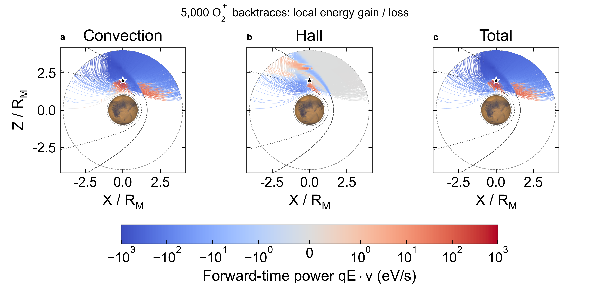

# 沿反向轨迹的局部增能与失能



三个面板分别显示对流、Hall、总电场对同一组轨迹的局部做功。沿用原随机轨迹图的 5000 个 O2+ 初始速度，随机种子 20260905，速率均匀分布于 10 至 200 km/s，初始 Vy=0，方向在 XZ 平面均匀分布。探头为 (0,0,2 Rm)，Rm=3390 km。三维轨迹投影到 XZ，后续 Vy 不限制为零。坐标轴沿用原图的模型笛卡尔 X、Z，不额外假定未经输入元数据确认的坐标变换。

## 颜色的物理意义

```math
P_j = q\mathbf E_j\cdot\mathbf v,\qquad j=\mathrm{conv,Hall,total}.
```

正值（红色）表示粒子沿正时间运动时局部增能，负值（蓝色）表示局部失能。磁力本身不做功。这里的加速/减速指速率或动能变化，不是加速度矢量大小。功率以 eV/s 表示，由 SI 的 q(C)、E(V/m)、v(m/s) 相乘后除以 1.602176634e-19 J/eV 得到。

虽然用负 dt 回溯，仍用物理速度和正离子电荷计算功率，不把功率符号反转。每个下降时间段的正时间做功为 `-q*dot(E_mid,v_mid)*dt/e`。绘图每 0.5 s 保存一段，以该段正时间做功除以其持续时间显示平均功率，最后不足 0.5 s 的段使用实际持续时间。积分步长为 -0.05 s；做功在每个积分步累积，未用稀疏保存位置估算速度。

配色为 coolwarm，使用 SymLogNorm，±1 eV/s 内线性，两侧以 10 为底对数，三个面板共用 ±1000 eV/s 范围。普通 LogNorm 不支持负功率。没有对空间进行分箱或插值，轨迹透明叠加会影响重叠区域的观感，不能把重叠区域解释为空间平均功率。边界曲线和火星使用 py_space_zc.maven.bs_mpb、plot_mars，延续原图。

这张图是局部平均功率，和 [速度网格全路径净能量图](energy_gain.md) 的单位及含义不同。同一条轨迹可先增能再失能，净变化是功率沿正时间的积分。所有项都在总场产生的轨迹上评价，不是分别在三个不同场中重新运动。

## 运行

从仓库根目录运行，复用已安装的 Julia 项目环境以及 Python 的 NumPy、Matplotlib、py_space_zc 和 Arial：

```sh
julia --startup-file=no --compiled-modules=existing --threads=1 --project=. examples/backward_tracing/probe_path_power.jl outputs/path_power_new_run 5000
python examples/backward_tracing/plot_path_power.py outputs/path_power_new_run
```

将 5000 改为 3 可运行小样本。原位置输出不含速度，因此本例从相同初始条件重新积分。保留 200 km 内边界、4 Rm 外边界和 500 s 时间上限。该例不计算源权重；400 km 源层不会终止轨迹。图只输出 PNG。

完整 segments.csv（480389 段）保存在本地运行目录，可由脚本重新生成。每行包含粒子编号、XZ 段端点以及三个电场项的平均功率。[逐粒子做功及终止统计](data/path_power_particles.csv) 与 [绘图检查](data/path_power_qa.json) 随示例保存。

## 验证与限制

初始速度与原图逐粒子一致。11 条到达内边界，4989 条到达外边界，没有超时或非有限值。最大整条轨迹能量闭合残差 0.2063 eV；以 max(abs(work),abs(delta K),1 eV) 为分母，99 百分位相对偏差为 0.00170%，最大为 0.1672%。总功率与对流加 Hall 功率的最大差为 2.49e-5 eV/s。210 项测试通过，包括观察回调输出的分段做功之和等于整条轨迹做功、两种 Boris 求解器以及正负功率符号。

这是随机速度轨迹的机制展示，不是经过源项加权的粒子群平均图。0.5 s 的显示平均可能隐藏更短时间的符号变化；能量闭合和原例的轨迹步长检查不能替代所有局部功率结构的显示间隔收敛检查。
