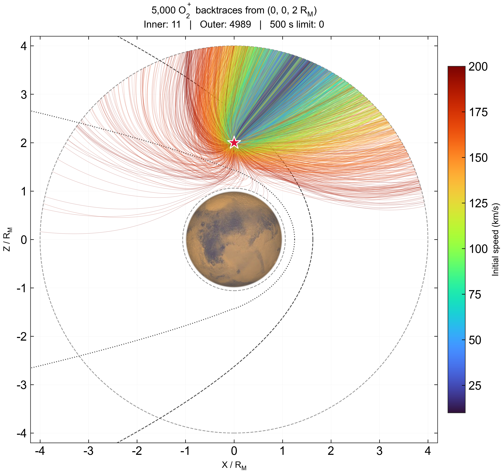

# 固定探头的 5000 个 O₂⁺ 反向追踪



## 文件与复现

- `random_probe_backtrace.jl`：Julia 轨迹积分、边界终止和步长减半检查。
- `plot_probe_backtrace.py`：调用同目录的 Julia 脚本，保存轨迹与诊断，绘制 XZ 图。
- `images/probe_backtrace_xz_5000.png`：已生成的 PNG 图片。

在仓库根目录执行：

```sh
python examples/backward_tracing/plot_probe_backtrace.py
```

只重绘已有结果：

```sh
python examples/backward_tracing/plot_probe_backtrace.py --data outputs/<run_id>/trajectories.jsonl
```

Python 需要 NumPy、Matplotlib、Arial 字体及 Chi Zhang 自定义的 `py_space_zc` 库，后者必须包含 `maven.bs_mpb`、`maven.plot_mars` 和默认火星贴图。这些外部依赖及贴图不复制到仓库。Julia 需要 PATH 中可用的 `julia`，并使用项目的 Project.toml 和 Manifest.toml。原始 MHD 场文件应位于 `data/mars_fields_spherical_from_dat.vts`，该大文件不随代码上传。

本次使用 Julia 1.12.6、TestParticle 0.23.3。脚本不自动安装依赖。默认粒子数为 5000，也可通过环境变量 `PARTICLE_COUNT` 修改；重绘时该值需与数据记录数一致。

每次运行的诊断及初始速度保存于新的 `outputs/probe_backtrace_<timestamp>/`。新积分还保存 `trajectories.jsonl`，每条记录包含粒子 ID、初始速度、负时间序列、三维位置及收敛诊断。重绘模式直接读取指定数据，不复制轨迹文件。图片输出固定在 `examples/backward_tracing/images/`，重新运行会更新同名图片。

## 初始条件与模型

| 参数 | 值 |
|---|---|
| 探头位置 | `(0, 0, 2 Rm)`，火心距离 |
| 火星半径 | 3390 km |
| 粒子 | 非相对论 O₂⁺，质量与正电荷取自 TestParticle SpeciesDict |
| 初始速率 | 在 10 至 200 km/s 均匀抽样 |
| 初始方向 | XZ 平面方向角在 0 至 2π 均匀抽样，初始 Vy = 0 |
| 随机数 | Xoshiro(20260905) |
| 积分 | Boris，时间从 0 向负方向积分，步长 −0.05 s |
| 对照步长 | −0.1 s，对全部 5000 个粒子检查 |
| 保存时间间隔 | 0.5 s，另存边界交点 |
| 内边界 | 离地 200 km |
| 外边界 | 火心距离 4 Rm |
| 最大回溯时间 | 500 s |
| 电磁场 | 静态总电场和磁场，复用 MarsTP 的球网格插值及单位转换 |

初始速度不额外取负，粒子电荷不变；反向追踪通过负时间步长实现。Vy = 0 仅为初始条件，实际积分保留三个位置和速度分量。没有碰撞、重力、化学权重或粒子反馈。边界跨越段与球面求交以确定最终位置，求交为线段近似，不进行域外场外推。

## 绘图定义

只画三维轨迹的 XZ 投影，等比例坐标轴，全部 5000 条轨迹均保留。turbo 颜色表示初始速率，红星为探头。使用 Arial 字体，183 mm 宽版面，不在图底部放说明文字。

`bs_mpb` 分别绘制 BS（深灰虚线）与 MPB（深灰点线），`plot_mars` 绘制半径为 1 Rm 的火星贴图。浅灰球面虚线表示积分内外边界。BS/MPB 仅是函数提供的经验参考曲线，既不是本次 MHD 场中测量得到的边界，也不是积分终止条件。

坐标沿用输入 MHD 数据的笛卡尔轴。仓库元数据尚未独立确立其 MSO/MSE 名称；经验曲线按 +X 为向阳方向叠加，不能据此证明模拟坐标与经验模型坐标完全一致。XZ 图包含所有 Y 位置，投影进入火星圆盘不等于实际粒子进入火星。

## 本次结果与检查

4989 个粒子到达外边界，11 个到达内边界，无粒子达到 500 s 上限。已检查粒子数、有限位置、初始速度范围、初始 Vy、严格递减的时间和径向边界交点。

步长从 0.1 s 减为 0.05 s 后，终止分类全部一致；共同时刻最大位置差为 0.001034 Rm（约 3.51 km），最大边界交点差为 0.000865 Rm（约 2.93 km），最大终止时间差约 0.0100 s。这是此次步长比较的结果，不是一般性的误差上界。

图片直接使用已验证的 5000 粒子轨迹重绘。经验边界和火星贴图不改变积分数据。PNG 已做视觉检查。
