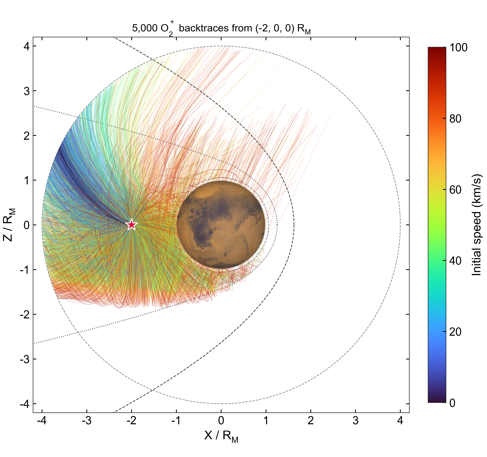
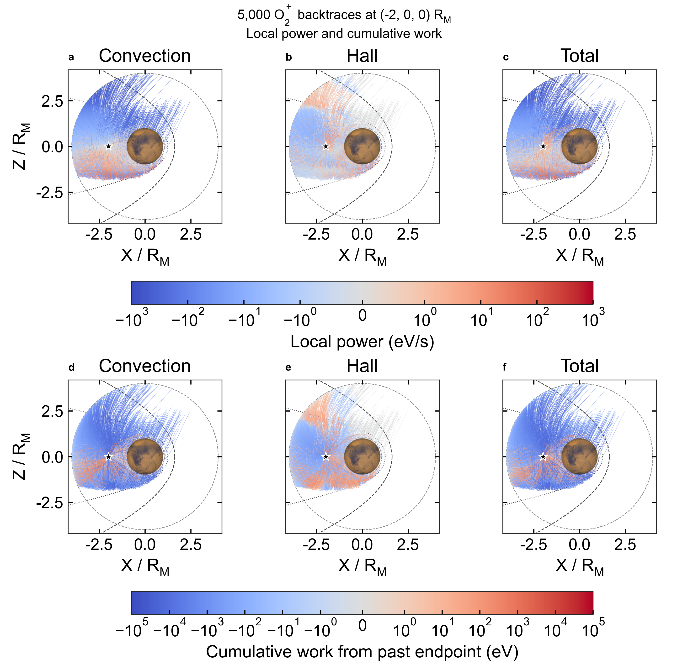

# Tail detector: 5000 O₂⁺ particles at (−2,0,0) Rm

The detector is at (−2,0,0) in model Cartesian coordinates, with Rm=3390 km. Speeds are uniform from 0 to 100 km/s and directions are isotropic in three dimensions. This differs from independent uniform velocity components or uniform sampling by velocity-space volume.

Julia Xoshiro with seed 20260905 samples `speed~Uniform(0,100 km/s)`, `mu=cos(theta)~Uniform(-1,1)` and `phi~Uniform(0,2pi)`, then sets `v=speed*(sqrt(1-mu²)cos(phi),sqrt(1-mu²)sin(phi),mu)`. Initial Vy may be nonzero.

## Figures and signs



Turbo indicates initial speed and the star marks the detector. Mars and reference boundaries use `src/visualization`; nonmathematical text uses Arial.



Columns show convective, Hall and total electric fields. The first row shows average power qE·v over each 0.5 s display segment (eV/s). The second shows work accumulated from the past endpoint (eV). Red indicates gain and blue loss. Coolwarm and SymLogNorm are linear within ±1 eV/s and ±1 eV, respectively. Panels share a scale within each row. Transparent path overlap is not a spatial average.

Backtracing uses negative dt without reversing charge or velocity. Each step contributes forward-time work `-qE·v dt`. Cumulative work is zero at the past endpoint and equals total path work at the detector. Total work is compared with `K_probe-K_endpoint`. See [definitions](path_power.md). These figures do not apply source-PSD weights or identify the past endpoint as a birthplace.

## Fields and termination

Trajectories use the static total field in `data/mars_fields_spherical_from_dat.vts`. Convective and Hall work are evaluated along the same total-field trajectory. The positive O₂⁺ charge is retained. Boundaries are 200 km and 4 Rm, with a 500 s lookback limit and Boris dt=−0.05 s. This example does not calculate source VDF weights.

A time-limited path represents work over a finite history, not a complete boundary-to-detector history. Boundary and time-limit statuses are recorded separately.

## Code and reproduction

Use [probe_path_power.jl](probe_path_power.jl) and [plot_path_power.py](plot_path_power.py) with `tail_isotropic`. The default mode retains the original (0,0,2) Rm detector. Run from the repository root using the Julia project and Python with NumPy, Matplotlib, h5py and Arial.

```sh
julia --startup-file=no --compiled-modules=existing --threads=1 --project=. examples/backward_tracing/probe_path_power.jl outputs/tail_probe_new_run 5000 tail_isotropic
python examples/backward_tracing/plot_path_power.py outputs/tail_probe_new_run
```

Replace 5000 with 5 for a small run; append −0.025 to halve the step. Use a new output directory. `case.json` records detector and sampling settings; `segments.csv` contains local and cumulative segment data; `particles.csv` contains initial velocities, termination, work, kinetic-energy change and residuals. Large segment files remain local. The [original detector example](path_power.md) uses different figure filenames.

## Recorded checks

Of 5000 paths, 935 reached the inner boundary, 3605 reached the outer boundary and 460 reached 500 s, without nonfinite states. Sampled speeds ranged from 0.0171 to 99.9785 km/s, with mean 50.4727 km/s. Mean squared direction components were 0.3392, 0.3347 and 0.3261, close to the isotropic expectation of 1/3.

The maximum energy-closure residual was 1.1545 eV. Relative to `max(abs(work),abs(delta K),1 eV)`, the 99th percentile was 0.0104%. Two low-net-work paths exceeded 1% and were flagged for refinement. In the five-particle half-step comparison, termination was unchanged; maximum changes in total, convective and Hall work were 0.04481, 0.04682 and 0.00201 eV. These selected checks do not establish full convergence.

- Per-particle energy (`tail_probe_particles.csv`, generated run output)
- Sampling configuration (`tail_probe_case.json`, generated run output)
- Sampling and half-step checks (`tail_probe_sampling_step_qa.json`, generated run output)
- Five-particle half-step results (`tail_probe_fine_pilot.csv`, generated run output)
- Refinement points (`tail_probe_refine_points.csv`, generated run output)

Status codes are 1=time limit, 2=inner boundary and 4=outer boundary. `residual_eV=total_eV-deltaK_eV`. Positive work means gain.

Two-point refinement (`tail_probe_energy_refinement.csv`, generated run output) at dt=0.00625 s reduced the maximum absolute and relative residuals to 0.00443091 eV and 0.0462687%. Original coarse data were retained. Run `julia --startup-file=no --compiled-modules=existing --project=. examples/backward_tracing/refine_energy_gain.jl outputs/tail_probe_new_run tail` after placing `refine_points.csv` in that directory.

Plot and cumulative-endpoint checks (`tail_probe_path_power_qa.json`, generated run output) cover 2,330,378 display segments, with a maximum endpoint discrepancy of 3.1e-11 eV. Figures are PNG only.
