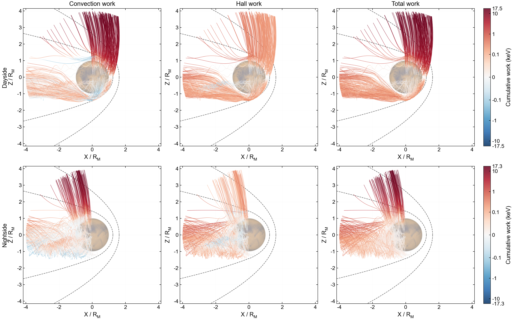

# Forward tracing from an 800 km release sphere

## O₂⁺ trajectories and electric work

These examples use the same random spherical release positions for 1000 initially stationary O₂⁺ particles. Figure 1 shows XZ and YZ projections in six panels; Figure 2 shows cumulative electric work along XZ projections. Julia handles integration and work analysis. Python uses Matplotlib and the MarsTP `src/visualization` module.

## Code

See [XZ and YZ trajectory panels](trajectories_xz_yz.md) for Figure 1.

| File | Purpose |
| --- | --- |
| [sphere_trajectories.jl](sphere_trajectories.jl) | Integration and boundary termination |
| [plot_sphere_trajectories.py](plot_sphere_trajectories.py) | Optional legacy XZ panels, `trajectories_xz_legacy.png` |
| [plot_trajectories_xz_yz.py](plot_trajectories_xz_yz.py) | All, dayside and nightside XZ/YZ panels |
| [hemisphere_work.jl](hemisphere_work.jl) | Per-particle work and energy closure |
| [plot_hemisphere_work.py](plot_hemisphere_work.py) | Dayside/nightside panels for three field terms |

The plotting scripts call Julia files in this directory. Paths are passed through stdout into Python memory; these examples save PNGs rather than trajectory files, so replotting reintegrates the trajectories.

## Initial conditions and boundaries

| Parameter | Value |
| --- | --- |
| Species | O₂⁺, mass and charge from TestParticle `SpeciesDict` |
| Release altitude | 800 km |
| Initial velocity | (0,0,0) m/s |
| Particle count | 1000, including 500 dayside and 500 nightside releases |
| Surface sampling | Uniform cos(theta) and azimuth |
| Random generator | `Xoshiro(20260905)` |
| Mars radius | 3390 km |
| Boundaries | 200 km altitude and 4 Rm from the center |
| Time limit | 20,000 s; reaching it is not a boundary crossing |
| Integration | TestParticle Boris, baseline dt=0.1 s, four Julia threads |
| Fields | Static `E_Total [V/m]` and `B_Field [T]` |

The nonrelativistic Lorentz model omits collisions, gravity, chemical source weights and feedback. BS and MPB are plotting references, not termination surfaces. XZ includes all Y positions and YZ includes all X positions; projected overlap with the Mars disk does not imply impact.

## Environment and inputs

1. Use a compatible Julia on PATH. The original figures used Julia 1.12.6 and the project Manifest.toml.
2. Prepare the project with `julia --project=. -e "using Pkg; Pkg.instantiate()"`.
3. Python requires NumPy, Matplotlib and h5py. Mars and boundaries are bundled in `src/visualization`.
4. Install the Arial font.
5. Provide `data/mars_fields_spherical_from_dat.vts`, including `B_Field [T]`, `E_Total [V/m]`, `E_conv [V/m]` and `E_hall [V/m]`, with MarsTP grid conventions. This large file is not distributed on GitHub.

These examples use electromagnetic fields only, without AMPS, GITM or source-rate MAT inputs. Scripts do not install dependencies automatically.

## Run

From the repository root:

```sh
python examples/forward_tracing/plot_trajectories_xz_yz.py
python examples/forward_tracing/plot_hemisphere_work.py
```

Default PNGs are written to `images/`, replacing matching names. To use different paths in PowerShell:

```powershell
$env:TRAJECTORY_PREVIEW = "$PWD/trajectory_preview.png"
$env:HEMISPHERE_WORK_PREVIEW = "$PWD/work_preview.png"
python examples/forward_tracing/plot_trajectories_xz_yz.py
python examples/forward_tracing/plot_hemisphere_work.py
```

Trajectory settings can be changed using `RELEASE_ALTITUDE_KM`, `PARTICLE_COUNT`, `TRACE_DT` and `TRACE_LIMIT` (defaults: 800, 1000, 0.1 and 20000). The work example fixes 800 km and 1000 particles. Its plotting script sets `WORK_HEMISPHERE=all`; Julia alone defaults to dayside analysis.

## Figure 1: XZ/YZ trajectories


Rows show all, dayside and nightside particles; columns show XZ and YZ. All axes have equal scale in Rm. Groups are defined by initial position, with dayside `X0>0` and nightside `X0<=0`, and remain fixed as particles move. Blue indicates the outer boundary and orange the inner boundary. Dark points mark release positions; gray circles mark the release sphere. XZ shows BS/MPB and the Mars image; YZ shows a geometric disk.

| Group | Outer boundary | Inner boundary |
| --- | ---: | ---: |
| All | 736 | 264 |
| Dayside | 453 | 47 |
| Nightside | 283 | 217 |

All particles in the original run reached a boundary; the longest flight was about 4148.53 s. Endpoints use the final segment's spherical intersection. Display points are thinned while the integration step remains 0.1 s.

## Figure 2: cumulative electric work



Rows show dayside and nightside releases. Columns show convective, Hall and total electric work. `Electric_field_work_profile(sol, itp)` evaluates all terms along the same total-field trajectory. With q in C, E in V/m, x in m, v in m/s and time in s, W below is in J:

$$
W_i(t)=q\int_{t_0}^{t}\mathbf E_i[\mathbf x(t')]\cdot\mathbf v(t')\,dt'.
$$

Colors show signed cumulative work from release, converted to keV. Red indicates gain and blue loss. The total term directly integrates `E_Total`. The function also returns instantaneous power and energy-closure residuals; see the root README and docstring.

Each row shares a symmetric logarithmic scale with a 0.1 keV linear threshold. Original ranges were about ±17.5032 keV on the dayside and ±17.3483 keV on the nightside. Read the color scales when comparing rows.

Work uses midpoint quadrature on saved integration steps; only display points are thinned. Field evaluation stops at the last valid state. If `abs(ΔK-W_total)/max(abs(ΔK),1 eV)` exceeds 0.1%, the example retries dt=0.05, 0.025 and 0.0125 s, then errors if necessary. Original maximum residuals were 0.0869% and 0.0520% for dayside and nightside. Energy closure alone does not establish trajectory convergence.

Removing a field term would also change the path, so this decomposition does not directly predict that modified simulation. Unweighted stationary releases do not represent physical particle fluxes.

## Checks

```sh
julia --threads=2 --project=. test/runtests.jl
```

Work tests cover Cartesian consistency, signed work, backward time, single and multiple particles, parallel results, invalid data and uniform-field energy closure. Examples also check counts, finite states, termination and work residuals.

## Monte Carlo source and detector distributions

See [Monte Carlo forward tracing](monte_carlo_forward_tracing/README.md) for weighted source sampling, trajectory storage and detector VDFs.
