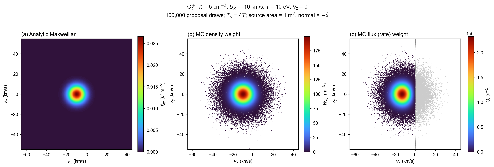
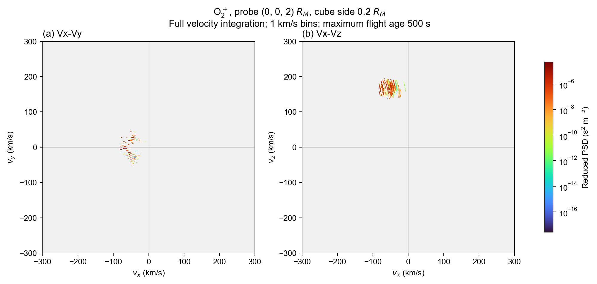
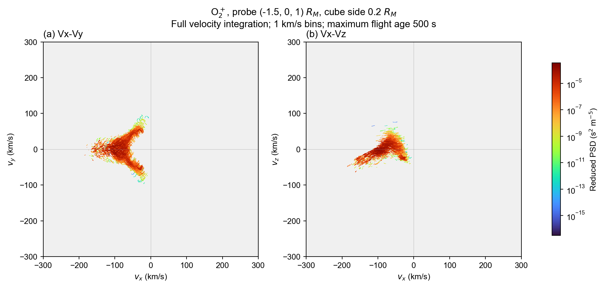

# O₂⁺：Monte Carlo 采样、forward tracing 与探头 PSD

本示例介绍如何对 O₂⁺ 进行 Monte Carlo 源采样、在 MHD 场中追踪轨迹，并通过立方体探头内的驻留时间计算速度分布。

## 1. Monte Carlo 源采样

Monte Carlo 用有限的计算粒子表示连续的速度分布。为增加高速尾部的样本，本例从较热的 proposal 分布抽样，再用重要性权重恢复目标分布。计算粒子并不代表相同的物理密度或粒子率。

### 1.1 二维教学示例



[绘图代码](plot_monte_carlo_sampling.py) 使用 O₂⁺，密度 5 cm⁻³（5×10⁶ m⁻³），bulk velocity 为 (−10,0) km/s，温度 10 eV，固定 vz=0，抽取 100,000 个二维速度样本。proposal 温度为 40 eV。为定义单位为 s⁻¹ 的粒子率，额外指定源面面积 **1 m²**、单位法向 **−X**。

三个 panel 均使用 turbo：左侧是解析二维分布，单位 s² m⁻⁵；中间是每个样本的 `density_weight`，单位 m⁻³；右侧是每个样本的 `flux_weight`，单位 s⁻¹。后两幅按单粒子权重着色。灰色点表示穿面率为零。

### 1.2 Maxwellian 与重要性抽样

先定义温度参数 T（eV，表示 kBT 的能量值）、换算常数 κ=1.602176634×10⁻¹⁹ J/eV、热能 εT（J）、粒子质量 m=5.352390155808×10⁻²⁶ kg，以及单分量热速度标准差 σ（m/s）：

$$
\epsilon_T=\kappa T,\qquad \sigma=\sqrt{\epsilon_T/m}.
$$

本例 σ=5.471184 km/s。令 d 为无量纲速度维数，教学例 d=2、实际源 d=3；速度 v、漂移速度 U 均为 m/s，g_d 为归一化概率密度，单位 (s/m)^d；n 为 m⁻³，f_d 的单位为 m⁻³(s/m)^d：

$$
g_d(\mathbf v)=\frac{\exp[-|\mathbf v-\mathbf U|^2/(2\sigma^2)]}{(2\pi\sigma^2)^{d/2}},\qquad f_d=n g_d.
$$

令 c=4 为无量纲温度倍率，T_s 为 proposal 温度（eV），σ_s 为 proposal 标准差（m/s）：

$$
T_s=cT,\qquad \sigma_s^2=c\sigma^2.
$$

粒子速度 v_i 从 g_s 抽样。g_d 与 g_s 的单位相同，重要性权重 w_i 无量纲；v_i、U、σ 均用 m/s，c、d 无量纲：

$$
w_i=\frac{g_d(\mathbf v_i)}{g_s(\mathbf v_i)}
=c^{d/2}\exp\left[-\frac{|\mathbf v_i-\mathbf U|^2}{2\sigma^2}\left(1-\frac1c\right)\right].
$$

因此二维示例的系数是 c，实际三维实现是 c^(3/2)。实现见 [sample_maxwellian_source、maxwellian_importance_weight_3d](../../../src/tracing/monte_carlo_weight.jl)。

### 1.3 两种单粒子权重

令 N 为无量纲抽样次数，n 为 m⁻³，w_i 无量纲，密度权重 W_i^(n) 为 m⁻³：

$$
W_i^{(n)}=n\frac{w_i}{\sum_{j=1}^{N}w_j},\qquad \sum_i W_i^{(n)}=n.
$$

`particle_density_weight` 计算上述密度权重。

令 A 为源面面积（m²），单位法向 n̂ 无量纲，v_i、v_n,i 为 m/s；n 为 m⁻³，N、w_i 无量纲，Q_i 为粒子率（s⁻¹，粒子数视为计数）：

$$
v_{n,i}=\mathbf v_i\cdot\hat{\mathbf n},\qquad
Q_i=\frac{nA}{N}\max(v_{n,i},0)w_i.
$$

Q_i 对应 `rate_weights_s`，也是图中的 `flux_weight`，表示源面粒子率。朝内粒子的率权重为零，N 包含全部抽样次数。

### 1.4 500 km 电离层源

在 500 km 高度从 MHD 读取每个面积单元的局部密度、流速和温度。源面也是吸收内边界，球面外法向为径向。令 r_s 为源面火心半径（m）、θ 为余纬（rad）、ϕ 为经度（rad）、A_cell 为 m²：

$$
A_{\rm cell}=r_s^2(\cos\theta_0-\cos\theta_1)(\phi_1-\phi_0).
$$

每个经纬度单元抽样 100 个三维速度，使用局部密度、面积和径向速度计算率权重。proposal 温度为局部温度的 4 倍，电离层之外不加入体积产生率。

## 2. Forward tracing

### 2.1 运动方程与函数

位置 x 用 m、速度 v 用 m/s、时间 t 用 s、质量 m 用 kg、电荷 q 用 C、电场 E 用 V/m、磁场 B 用 T。O₂⁺ 的 q=+1.602176634×10⁻¹⁹ C，质量与上文一致。非相对论运动方程为：

$$
\frac{d\mathbf x}{dt}=\mathbf v,\qquad
\frac{d\mathbf v}{dt}=\frac qm\left(\mathbf E+\mathbf v\times\mathbf B\right).
$$

本例入口为 [ShellMonteCarlo.run_monte_carlo](monte_carlo_shell.jl)，内部由 `ShellMonteCarlo.trace_particle` 推进粒子，调用 `MarsTP.TP.boris_velocity_update` 完成 Boris 速度更新。使用静态 MHD 总电场和磁场。半步速度用于积分，保存状态时转换为与位置同一时刻的速度。

| 参数 | 设置 |
| --- | --- |
| 火星半径 | Rm=3390 km |
| 释放高度、吸收内边界高度 | 500 km |
| 外边界火心距离 | 4 Rm |
| 时间步、最大飞行年龄 | 0.1 s、500 s |
| 忽略过程 | 体积产生、碰撞、复合、重力、反馈 |
| 终止类型 | inner、outer、time_limit、zero_rate；数值失败报错 |

无损传播期间每条轨迹的 Q_i 保持不变。

### 2.2 5000 条轨迹


[plot_trajectories.py](plot_trajectories.py) 展示 5000 条粒子轨迹在 XZ、XY、YZ 平面的投影。

## 3. 探头的三维 PSD 与二维 VDF

### 3.1 粒子率乘驻留时间

令 dN 为粒子计数，x 用 m、v 用 m/s、n 用 m⁻³；三维速度分布 f 的单位为 s³ m⁻⁶：

$$
dN=f(\mathbf x,\mathbf v)d^3x\,d^3v,\qquad n(\mathbf x)=\int f(\mathbf x,\mathbf v)d^3v.
$$

立方体边长 L=0.2 Rm=678,000 m，空间体积 V_D 用 m³；各速度 bin 宽度 Δv_x、Δv_y、Δv_z 用 m/s，速度空间体积 Δ³v_b 用 m³ s⁻³：

$$
V_D=L^3,\qquad \Delta^3v_b=\Delta v_x\Delta v_y\Delta v_z.
$$

令 τ_i,D,b 为驻留时间（s），T_i 为该轨迹的保存时长（s），x_i 用 m、v_i 用 m/s，空间区域 D 与速度 bin B_b 的指示函数为无量纲：

$$
\tau_{i,D,b}=\int_0^{T_i}\mathbf1_D[\mathbf x_i(t)]\mathbf1_{B_b}[\mathbf v_i(t)]\,dt.
$$

对稳恒源，Q_i 用 s⁻¹，τ_i,D,b 用 s，N_D,b 为平均粒子计数；V_D 用 m³、Δ³v_b 用 m³ s⁻³，空间和速度 bin 平均 PSD f̄_D,b 的单位为 s³ m⁻⁶：

$$
N_{D,b}=\sum_i Q_i\tau_{i,D,b},\qquad
\boxed{\bar f_{D,b}=\frac{\sum_i Q_i\tau_{i,D,b}}{V_D\Delta^3v_b}}.
$$

Q_i 已包含抽样归一化，因此计算 PSD 时不再除以粒子数或总积分时间。稳恒源和静态场下，最大飞行年龄决定驻留积分的截断范围。

### 3.2 计算函数与速度分箱

- [forward_psd](../../../src/tracing/detector_psd_forward.jl)：从内存轨迹计算。
- [forward_psd_saved、foreach_saved_trajectory](../../../src/tracing/trajectory_io.jl)：从分批文件读取。
- [analyze_saved_probes.jl](analyze_saved_probes.jl)：一次读取轨迹，计算多个探头的 PSD。

每个相邻保存状态之间，位置和同步速度均线性插值。令 α、α_a、α_b 为无量纲段内比例，x_0、x_1 用 m、v_0、v_1 用 m/s、Δt 和 δt 用 s：

$$
\mathbf x(\alpha)=\mathbf x_0+\alpha(\mathbf x_1-\mathbf x_0),\quad
\mathbf v(\alpha)=\mathbf v_0+\alpha(\mathbf v_1-\mathbf v_0),\quad
\delta t=\Delta t(\alpha_b-\alpha_a).
$$

先将线段裁剪到立方体，再按速度 bin 边界拆分，累加各段的率乘时间。两端都在探头外、但中途穿过的段也会统计。探头空间采用下闭上开边界；速度末端全局上边界包含在最后一格。

三个速度轴均为 −500 到 500 km/s，bin 宽度 5 km/s，即 200³ 个 bin。三维 PSD 用稀疏结构保存非零值。

```julia
using MarsTP
Rm = 3_390_000.0 # m
settings = (; detector_m=[0.,0.,2.] * Rm, side_m=0.2Rm,
             vlim=(-500.,500.), vgrid=200, velocity_unit=:km_s,
             species="O2+", coordinate_system="native MHD Cartesian axes")

# 已在内存中的轨迹：solutions 的 t/u 必须为同步的 s、m、m/s。
r3 = forward_psd(solutions; settings..., rate_weights_s=Q, option="3D")
# 从保存目录逐条读取轨迹。
r3 = forward_psd_saved("outputs/my_run"; settings..., option="3D", storage=:sparse)
# 也可直接取得完整速度积分的二维结果。
rxy = forward_psd_saved("outputs/my_run"; settings..., option="Vx-Vy")
```

`vgrid=200` 表示每轴 bin 数，对应 5 km/s 的宽度。`velocity_unit=:km_s` 指定输入速度范围的单位，输出速度边界与中心仍为 m/s；`storage=:sparse` 返回稀疏三维 PSD。

### 3.3 完整积分得到二维图

令 f_ijk 为三维 PSD（s³ m⁻⁶），Δv_y=Δv_z=5000 m/s；二维 F_xy、F_xz 的单位为 s² m⁻⁵：

$$
F_{xy}(v_{x,i},v_{y,j})=\sum_k f_{ijk}\Delta v_{z,k},\qquad
F_{xz}(v_{x,i},v_{z,k})=\sum_j f_{ijk}\Delta v_{y,j}.
$$

求和覆盖被省略速度轴的完整 ±500 km/s 范围。图的横纵轴显示 ±300 km/s，色标保持 SI 单位。

令 n_D 为所选速度范围内的探头平均密度（m⁻³），f 为 s³ m⁻⁶，F 为 s² m⁻⁵，Δv 为 m/s，Q 为 s⁻¹、τ 为 s、V_D 为 m³：

$$
n_D=\sum_{ijk}f_{ijk}\Delta v^3
=\sum_{ij}F_{xy,ij}\Delta v^2
=\sum_{ik}F_{xz,ik}\Delta v^2
=\frac{\sum_iQ_i\tau_{i,D}}{V_D}.
$$

最后一个等号要求速度范围包含全部驻留贡献。

### 3.4 探头示意图

中心 (1,0,2) Rm：


中心 (0,0,2) Rm：



中心 (−1.5,0,1) Rm：



图中颜色表示二维积分 VDF（s² m⁻⁵），使用 turbo 对数色标。

### 3.5 穿面通量与驻留密度

令 A_face 为 m²，Q_i 为 s⁻¹，指定面和方向的穿面事件集合为 C，通量 Γ 为 m⁻² s⁻¹：

$$
\Gamma=\frac{\sum_{i\in C}Q_i}{A_{\rm face}}.
$$

不要用穿面事件计数替代驻留时间密度。以匀速垂直穿过立方体的束流为例，n 用 m⁻³、u 用 m/s、L 用 m、Q 用 s⁻¹、τ 用 s：

$$
Q=nuL^2,\qquad \tau=L/u,\qquad \frac{Q\tau}{L^3}=n.
$$

这说明速度较大的粒子虽然穿面率更大，但驻留时间更短，两者共同恢复正确密度。

## 4. 运行与保存

在仓库根目录使用项目 Julia 环境运行。源采样与追踪需要 MHD 文件 `data/mars_fields_spherical_from_dat.vts`。

```julia
include("examples/forward_tracing/monte_carlo_forward_tracing/monte_carlo_shell.jl")
ShellMonteCarlo.run_monte_carlo("outputs/my_run",
    ShellMonteCarlo.Config(per_cell=100, dt=0.1, tmax=500., batch_size=1024,
                          flux_model="reservoir_maxwellian_rate", compress_trajectories=false))
```

[write_trajectory_batch](../../../src/tracing/trajectory_io.jl) 分批保存轨迹及率权重。位置用 m、速度用 m/s、时间用 s，`rate_weights_s` 用 s⁻¹，`source_density_weights_m3` 用 m⁻³：

```julia
using MarsTP
write_trajectory_batch("outputs/my_run/trajectories_00001.jld2", trajectory_batch;
    particle_ids=ids, rate_weights_s=Q,
    source_density_weights_m3=density_weights, cell_ids=cell_ids,
    termination_codes=statuses, species="O2+",
    coordinate_system="native MHD Cartesian axes", compress=false)
```

每条轨迹的状态顺序为 t,x,y,z,vx,vy,vz，另存粒子 ID、权重和终止类型。`compress=true` 启用无损压缩，输出文件路径须尚未存在。

计算探头 PSD 并绘图：

```powershell
$example = 'examples/forward_tracing/monte_carlo_forward_tracing'
julia --project=. "$example/analyze_saved_probes.jl" outputs/my_run outputs/my_probes
python "$example/plot_library_psd.py" outputs/my_probes
```

重新生成 Monte Carlo 采样示意图：

```powershell
python examples/forward_tracing/monte_carlo_forward_tracing/plot_monte_carlo_sampling.py
```

Python 绘图使用 NumPy、Matplotlib 和 h5py，轨迹背景使用 [src/visualization](../../../src/visualization/README.md) 中的火星与 BS/MPB 绘图函数。

| 代码 | 用途 |
| --- | --- |
| [plot_monte_carlo_sampling.py](plot_monte_carlo_sampling.py) | Maxwellian 与单粒子权重示意图 |
| [monte_carlo_shell.jl](monte_carlo_shell.jl) | 电离层采样、Boris 追踪和分批保存 |
| [plot_trajectories.py](plot_trajectories.py) | 轨迹投影图 |
| [analyze_saved_probes.jl](analyze_saved_probes.jl) | 从已保存轨迹计算探头 PSD |
| [plot_library_psd.py](plot_library_psd.py) | 三维 PSD 的二维积分图 |
