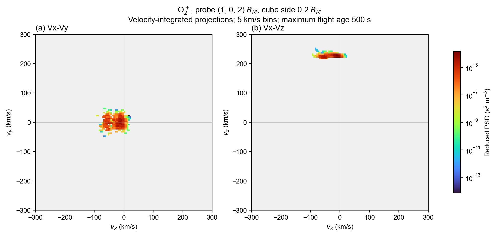
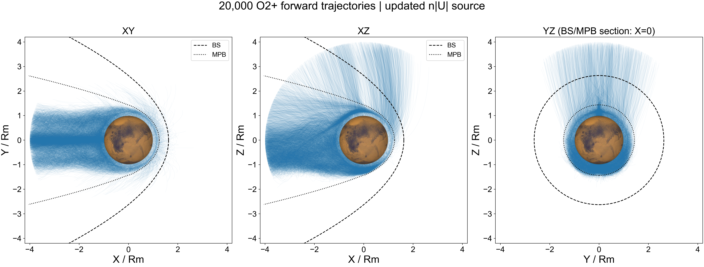

# O₂⁺ Monte Carlo forward tracing, 500 km source and cubic detector

此示例从 500 km 电离层边界释放 O₂⁺，保存每个粒子的权重、位置、速度，并由探头内的驻留时间建立三维速度分布。理论推导见 [monte_carlo.md](monte_carlo.md)。本目录提供实际运行脚本与 PNG，不包含约 48.3 GB 的原始轨迹或 MHD 输入。

## 图



两个投影分别积分掉 vz、vy，单位为 **s² m⁻⁵**。三维速度网格各轴从 −500 到 500 km/s，宽度 **5 km/s**，共 **200³** 个 bin；绘图 xlim、ylim 均为 **[−300, 300] km/s**。使用 turbo、对数色标和 Arial，PNG 图底部不加说明文字。灰色表示没有抽样贡献，无平滑。

三维网格以 COO 稀疏格式保存非零 bin，未保存的 bin 为本次抽样估计中的零值。先计算完整三维 PSD，再对完整的被省略速度轴求和乘以 Δv = 5000 m/s，得到二维投影。显示窗口仍为 ±300 km/s，三个探头的全部信号都在此窗口内。这里不再输出零速度切片。

两个新增探头示例：[**(0,0,2) Rm**](probe_0_0_2/README.md)、[**(−1.5,0,1) Rm**](probe_m1p5_0_1/README.md)。它们使用同一套完整已保存轨迹，不重新采样或积分。



从正率且实际传播时间大于 0 的粒子中，用 NumPy `default_rng(20260906)` 蓄水池抽样等概率选出 **5000** 条，不优先挑选探头命中者。颜色表示终止原因：`inner` 返回 500 km，`outer` 到达 4 Rm，`time_limit` 达到 500 s。这是轨迹示意图，线条没有按物理权重加粗或重采样。

绘图读取已保存的实际轨迹，每条最多显示 300 个均匀索引点，保留首尾点；此降采样仅用于显示，积分、探头统计和原始数据均保持 0.1 s。选择 ID 保存在 [trajectories_5000.selection.json](trajectories_5000.selection.json)。

背景使用 `py_space_zc.maven.bs_mpb` 和 `plot_mars`。XZ、XY 中的虚线、点线分别为库内 BS、MPB 经验 X–ρ 曲线，假定 +X 朝向太阳，仅作参考，不是从本次 MHD 提取的边界。YZ 不画这种二维曲线。圆盘是火星，外侧灰圆是 500 km 释放面，洋红方框是探头投影。**数据仍标为原生 MHD 笛卡尔坐标，尚未核实其 MSO/MSE 来源**，因此不能据参考曲线判断边界符合程度。

## 模型和单位

- O₂⁺，质量 5.352390155808×10⁻²⁶ kg，电荷 +e；静态 MHD 总 E、B，非相对论 Boris 积分。
- Rm = 3390 km；释放面及吸收内边界为离地 500 km，外边界为火心距离 4 Rm。
- 原生球面 71×143 = 10,153 个角度单元，各 100 次完整 Maxwellian proposal draws，总计 1,015,300 次；局部 n、Ui、Ti 在各面积中点读取。
- proposal 温度 Ts = 4Ti，各格 Julia RNG 为 `Xoshiro(20260906 + cell_id)`，不依赖线程顺序。
- dt = 0.1 s，最大飞行年龄 500 s；探头中心 (1,0,2) Rm，边长 0.2 Rm = 678 km。
- 不加入电离层外体积产生、碰撞、复合、重力或粒子反馈。

直接调用 [sample_maxwellian_source](../../../src/tracing/monte_carlo_weight.jl)，采用 reservoir 的单向穿面率权重：

```text
w_i = g(v_i; Ui,Ti) / gs(v_i; Ui,4Ti)                [dimensionless]
Q_i = rate_weight_s1 = n A max(v_i · er, 0) w_i / N   [s^-1]
N = 100, including inward draws
source_density_weight_m3 = n w_i / sum_cell(w)        [m^-3, diagnostic only]
```

向内样本 Q=0，保存初态但不传播，不重新抽样补足向外样本。Q 不做自归一化。CSV 的 `source_flux_m2_s=n|Ui|` 仅是旧模型对照诊断，**不用于此运行的 Q**；因此本运行不是固定 n|Ui|A 总率模型。

```text
f3d[b] = sum_i Q_i * dwell_time_i_in_bin / (V * dvx*dvy*dvz) [s^3 m^-6]
n = sum_b f3d[b] * dvx*dvy*dvz                             [m^-3]
fxy = integral f3d dvz; fxz = integral f3d dvy              [s^2 m^-5]
face_flux_m2_s = Q_i / A_face                             [m^-2 s^-1]
```

内部位置、速度分别为 m、m/s，速度 bin 体积用 SI 单位；图轴才转为 km/s。驻留时间估计器不再除以总运行时间或粒子数。每步先求轨迹段与立方体交集，再按线性插值速度穿越 bin 的位置切分驻留时间。位置与速度使用同步端点。

## 公共计算方法

本目录当前 PNG 和 NPZ 直接来自 [detector_psd_forward.jl](../../../src/tracing/detector_psd_forward.jl) 使用的公共计算核心 [ForwardPSDAccumulator](../../../src/tracing/forward_psd_accumulator.jl)。内存入口 `forward_psd`、磁盘入口 `forward_psd_saved` 和本例的一次扫描三个探头均调用同一个 `accumulate_forward_psd!`，不再独立运行 Python 分箱算法。

每个保存段的位置、速度都做线性插值；立方体采用 `[lower,upper)`，速度网格最后一个上边界包含在内。速度范围外的贡献单独报告，不默默截断或重新归一化。探头边界交点不重新调用 Boris 或读取 MHD 场。

```julia
using MarsTP
settings = (; detector_m=[0.,0.,2.] * Rm, side_m=0.2Rm,
             vlim=(-500.,500.), vgrid=200, velocity_unit=:km_s,
             species="O2+", coordinate_system="native MHD Cartesian axes")

# 已在内存中的轨迹：solutions 的 t/u 必须为同步的 s、m、m/s。
r3 = forward_psd(solutions; settings..., rate_weights_s=Q, option="3D")
# 约 50 GB 的保存目录：逐条读取，不将整个集合装入内存。
r3 = forward_psd_saved("outputs/my_run"; settings..., option="3D", storage=:sparse)
# 也可直接取得完整速度积分的二维结果。
rxy = forward_psd_saved("outputs/my_run"; settings..., option="Vx-Vy")
```

`vgrid=200` 是每轴 bin 数，范围 ±500 km/s 对应宽度 5 km/s。`storage=:dense` 保留原有数组接口；`:sparse` 返回一基 bin 元组到 PSD 值的 Dict。已发布 NPZ 转为零基 COO 索引。重复调用 `forward_psd_saved` 会重复读取磁盘，因此本例多探头使用下述一次扫描入口。

## 保存约 50 GB 轨迹的函数

[write_trajectory_batch](../../../src/tracing/trajectory_io.jl) 是可复用的库函数。每批只保留当前批次的轨迹，逐批写入后释放内存；总输出可以很大，内存不随全部历史状态线性增长。

```julia
using MarsTP
write_trajectory_batch("outputs/my_run/trajectories_00001.jld2", trajectory_batch;
    particle_ids=ids, rate_weights_s=Q,
    source_density_weights_m3=density_weights, cell_ids=cell_ids,
    termination_codes=statuses, species="O2+",
    coordinate_system="native MHD Cartesian axes", compress=false)
```

必需参数是 `particle_ids` 和物理粒子率 `rate_weights_s`，其余诊断可省略。函数拒绝覆盖现有路径。文件保存 Float64 的 `p<ID>/state`，Julia 为 7×N，h5py 为 N×7，顺序 t,x,y,z,vx,vy,vz，单位 s、m、m/s。每个粒子同时保存率权重；文件还保存格式版本、单位、种类、坐标说明、终止类型及批次完成标记。`compress=true` 可无损压缩，默认关闭。中途失败的文件不带完成标记，读取器会拒绝使用。

完整的源采样、追踪和保存入口是 [ShellMonteCarlo.run_monte_carlo](monte_carlo_shell.jl)：

```julia
include("examples/forward_tracing/monte_carlo_forward_tracing/monte_carlo_shell.jl")
ShellMonteCarlo.run_monte_carlo("outputs/new_rate100_run",
    ShellMonteCarlo.Config(per_cell=100, dt=0.1, tmax=500., batch_size=1024,
                          flux_model="reservoir_maxwellian_rate", compress_trajectories=false))
```

该函数实际调用 `write_trajectory_batch`，不是另一套内嵌写盘实现。原始运行约 48.3 GB 文件继续可用，读取接口兼容原来的 legacy p<ID> 格式，无需重写。旧文件未保存的逐粒子终止码返回 `unavailable`，不伪造成功状态；原 `particles.csv` 仍保留实际终止原因。

## 文件与复现

在仓库根目录运行，使用本仓库 Project.toml / Manifest.toml。Python 仅用于 PNG 和可移植 NPZ 输出，需要 NumPy、Matplotlib、h5py。轨迹示意图另用 `py_space_zc`。

首次模拟需要 `data/mars_fields_spherical_from_dat.vts`，SHA256 为 `fa92bd82fe16975ad0d50f4e40ace344e9d41389d6024976d423e6126bc7a5c8`。对已保存轨迹计算 PSD 不需要重新读取 MHD。原始模拟为 Julia 1.12.6、MarsTP 提交 `58e078fa4d853a0307df0e9c87b9b44528835dc7`。

```powershell
$example = 'examples/forward_tracing/monte_carlo_forward_tracing'
$run = 'outputs/mc500_rate100_full_20260906a'
$reprobe = 'outputs/new_library_psd'
$py = 'C:\Users\Win\.conda\envs\mars\python.exe'
# 一次读取全部批次，并计算三个探头。输出目录必须不存在。
julia --startup-file=no --compiled-modules=existing --project=. "$example/analyze_saved_probes.jl" $run $reprobe
# 只画库函数已经计算好的 PSD，不再在 Python 中分箱。
& $py "$example/plot_library_psd.py" $reprobe
```

需要从头重新模拟时，先设置新的 `$run`，再执行：

```powershell
$env:MC_GIT_COMMIT = git rev-parse HEAD
$env:MC_GIT_STATUS = (git status --short) -join "`n"
julia --startup-file=no --compiled-modules=existing --threads=12 --project=. "$example/monte_carlo_shell.jl" $run 1 500 0.1 100 reservoir_maxwellian_rate false
```

不要为重新分 bin 或增加探头而重跑原始积分。可先用 cell stride=36、tmax=0.2、dt=0.1、per_cell=2 做小样本写盘检查。

| 文件 | 用途 |
| --- | --- |
| [analyze_saved_probes.jl](analyze_saved_probes.jl) | 一次读取全部轨迹，三个公共累积器计算 PSD 和探头记录 |
| [plot_library_psd.py](plot_library_psd.py) | 读取库计算的 JLD2，核验积分、输出 PNG/NPZ/JSON |
| [monte_carlo_shell.jl](monte_carlo_shell.jl) | 源采样、Boris、公共分批保存函数 |
| [plot_trajectories.py](plot_trajectories.py) | 5000 条轨迹示意图 |
| [test_monte_carlo.jl](test_monte_carlo.jl) | 源模型、几何与积分测试 |
| [trajectory_io.jl](../../../test/trajectory_io.jl) | 磁盘与内存结果一致、压缩、legacy、异常输入测试 |

`reprobe_saved.py` 兼容入口转发到 Julia；`analyze_monte_carlo.py`、`analyze_probe.py` 的命令行转发到库结果绘图。其中旧 Python 分箱函数只保留为独立回归参考，不用于当前发布结果。`synchronize_reprobe.jl` 已停用，会明确提示使用新的公共入口，防止误用旧 Boris 交点处理。

每个探头输出 `library_psd.jld2`、`library_summary.toml`、`probe_residence.csv`，绘图步骤另存 PNG、`probe_psd_sparse.npz`、`analysis_summary.json`、逐粒子权重/驻留时间 CSV、穿面通量/速度 CSV。完整扫描成功后才写入 `analysis_complete.toml`。已发布的小型 NPZ 包含三维非零值、零基索引、完整边界和二维投影：

```python
import numpy as np
with np.load('probe_psd_sparse.npz') as a:
    ix, iy, iz = a['indices_xyz'].T
    fxy = np.zeros(tuple(a['shape_xyz'][:2]))
    np.add.at(fxy, (ix, iy), a['f3d_s3_m6'] * float(a['dv_ms']))
    np.testing.assert_allclose(fxy, a['fxy_s2_m5'])
```

## 已保存轨迹上的三个探头

| 探头位置 (Rm) | 密度 (cm⁻³) | 独立命中粒子 | 驻留权重有效样本数 | 驻留段 |
| --- | ---: | ---: | ---: | ---: |
| (1,0,2) | 0.0309669 | 416 | 119.29 | 11,151 |
| (0,0,2) | 0.001002168 | 115 | 9.71 | 3,328 |
| (−1.5,0,1) | 0.1177217 | 2,011 | 353.71 | 124,374 |

当前图来自 `mc500_library_psd_20260906`，公共接口完整读取原运行的 992 个批次和 1,015,300 个粒子组。三个探头均满足 `sum(f3d)*dv³ = sum(fxy)*dv² = sum(fxz)*dv² = sum(Q*tau)/V`，速度范围外密度为零。色标独立归一化，不宜只凭颜色跨图比较。特别是 (0,0,2) 的有效样本数约 9.7，5 km/s 细结构仍受抽样噪声影响。

相较以前的 Boris 交点重算版本，密度与命中数不变，六个二维投影的相对 L1 差异最大 2.48×10⁻⁶，约 0.00025%。详见 [method_comparison.json](method_comparison.json)。旧 `original_probe_validation.json` 是旧交点方法的历史校验，不代表当前方法。

## 验证与限制

- 包内全部 312 项测试通过，其中 25 项覆盖分批读写及内存/磁盘 PSD 等价；示例 226 项测试通过。
- 使用新 `run_monte_carlo` 和 `write_trajectory_batch` 完成 566 个样本、0.2 s 的实际 MHD 小规模写盘运行；未重写原始 48.3 GB。
- 原运行正率 506,259 个、零率 509,041 个；inner 315,992、outer 108,153、time_limit 82,114，无数值失败。12 线程积分写盘约 589.5 s。
- 最大飞行年龄 500 s，达到时限的源率占 18.13%，未证明稳态或完整 PSD 收敛。以前 231 条子集时间步细化改变探头密度约 −0.00107%、−0.00218%，不代表完整集合收敛。
- 原轨迹整体最大做功闭合残差约 0.173 eV；320 条相对残差超过 1%（分母以 1 eV 为下限）。原始轨迹均保留。

```powershell
julia --startup-file=no --compiled-modules=existing --project=. test/runtests.jl
julia --startup-file=no --compiled-modules=existing --project=. "$example/test_monte_carlo.jl"
```

环境记录：仅将 Manifest 中已有的标准库 TOML 声明为直接依赖，保留所有锁定版本。现有本地 Registry 缺少锁定的 UnsafeAtomics 0.3.2，`Pkg.resolve()` 未完成；未因此升级包。已安装环境可完成上述测试和运行。
