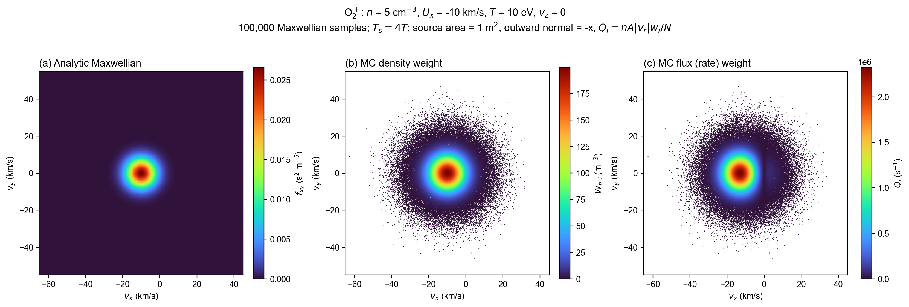
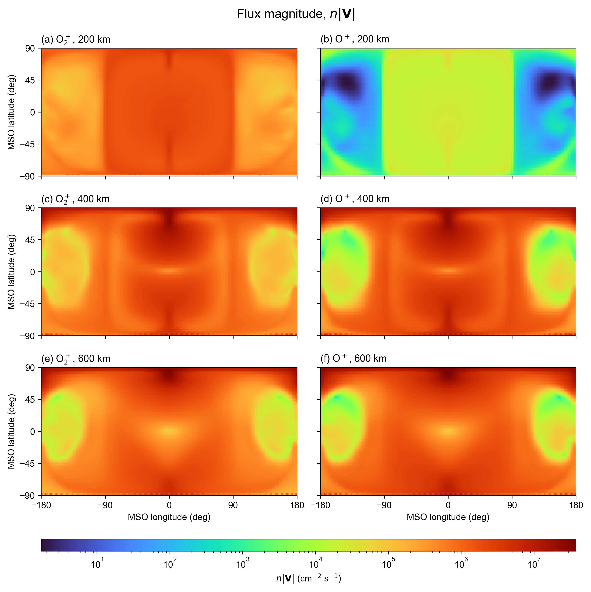
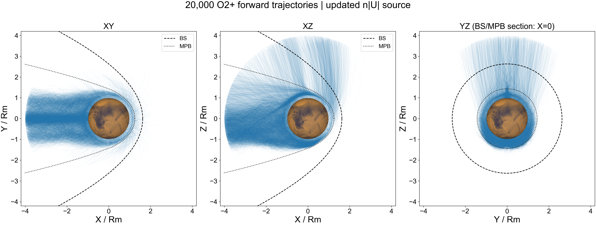
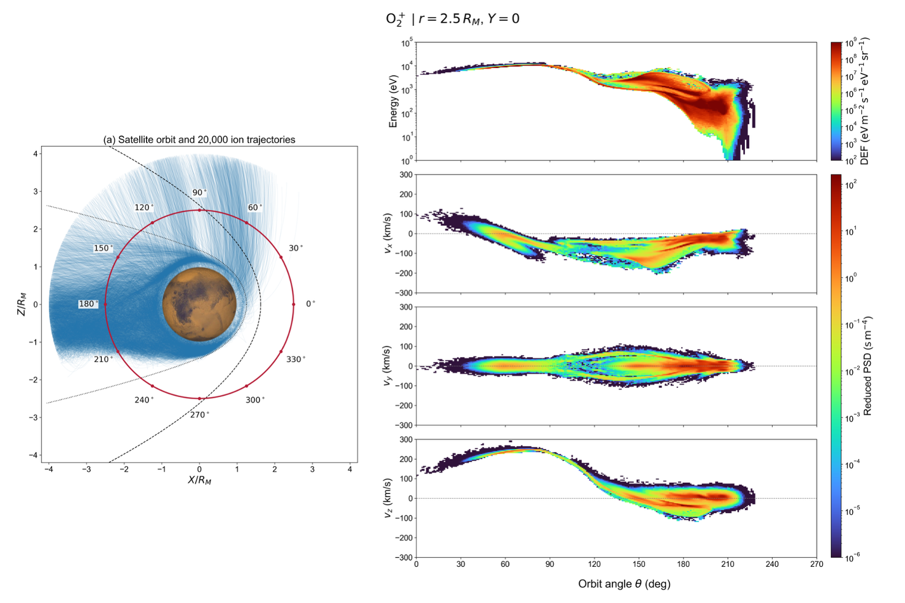
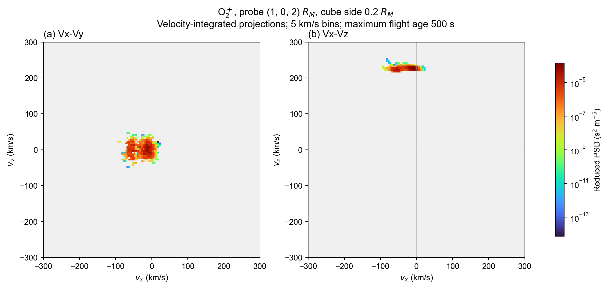

# O₂⁺ Monte Carlo sampling, forward tracing and detector PSD

This example samples O₂⁺ source particles, follows their trajectories through MHD fields, and reconstructs velocity distributions from residence times inside a cubic detector.

## 1. Monte Carlo source sampling

Monte Carlo represents a continuous velocity distribution with a finite set of weighted particles. Here, velocities are drawn from a broader Maxwellian to improve sampling of the high-speed tail. Importance weights recover the physical distribution.

### 1.1 Two-dimensional illustration



The [plotting script](plot_monte_carlo_sampling.py) uses O₂⁺ at density 5 cm⁻³ (5×10⁶ m⁻³), bulk velocity (−10,0) km/s and physical temperature 10 eV. It draws 100,000 two-dimensional velocities with vz=0. The **sampling Maxwellian** has temperature 40 eV. A source area of **1 m²** and bulk speed **10 km/s** define the prescribed particle-rate weights. Both signs of each sampled velocity component are retained.

All three panels use turbo. The left panel shows the analytical two-dimensional Maxwellian (s² m⁻⁵). The middle and right panels color individual samples by `density_weight` (m⁻³) and `flux_weight` (s⁻¹), respectively. The rate weight is the density weight multiplied by area and bulk speed. There is no velocity-sign cutoff or shaded excluded half-plane.

### 1.2 Maxwellian sampling and importance weights

Let T be the physical temperature expressed as kBT in eV, κ_E=1.602176634×10⁻¹⁹ J/eV the energy conversion factor, ε_T the thermal energy in J, and m=5.352390155808×10⁻²⁶ kg the O₂⁺ mass. The one-component velocity standard deviation σ is in m/s:

$$
\epsilon_T=\kappa_E T,\qquad \sigma=\sqrt{\epsilon_T/m}.
$$

Let d be the dimensionless velocity-space dimension (2 in the illustration and 3 for the source). Velocities v and U are in m/s, the normalized probability density g_d has units (s/m)^d, number density n is in m⁻³, and f_d has units m⁻³(s/m)^d:

$$
g_d(\mathbf v)=\frac{\exp[-|\mathbf v-\mathbf U|^2/(2\sigma^2)]}{(2\pi\sigma^2)^{d/2}},\qquad f_d=n g_d.
$$

The sampling temperature T_s is in eV and its standard deviation σ_s is in m/s. The dimensionless temperature ratio c=4 specifies how much broader the sampling Maxwellian is:

$$
T_s=cT,\qquad \sigma_s^2=c\sigma^2.
$$

For samples v_i drawn from the normalized sampling density g_s, g_d and g_s have the same units and their ratio w_i is dimensionless. With v_i, U and σ in m/s and c and d dimensionless:

$$
w_i=\frac{g_d(\mathbf v_i)}{g_s(\mathbf v_i)}
=c^{d/2}\exp\left[-\frac{|\mathbf v_i-\mathbf U|^2}{2\sigma^2}\left(1-\frac1c\right)\right].
$$

The prefactor is c in the two-dimensional illustration and c^(3/2) in the three-dimensional implementation. See [sample_maxwellian_source and maxwellian_importance_weight_3d](../../../src/tracing/monte_carlo_weight.jl).

The density-ratio principle also applies to a κ distribution: replace the physical and sampling probability densities by the intended normalized distributions, and evaluate their ratio at each sample. The sampling distribution must cover the support of the physical distribution. Efficient sampling of κ tails generally requires a suitable heavy-tailed sampling distribution. The current source function implements Maxwellian sampling; κ sampling requires an additional sampler and density evaluation. The Maxwellian exponential expression above does not apply unchanged to κ distributions.

### 1.3 Density and particle-rate weights

Let N be the dimensionless number of draws, n the number density in m⁻³, and w_i dimensionless importance weights. The density weight W_i^(n), in m⁻³, is:

$$
W_i^{(n)}=n\frac{w_i}{\sum_{j=1}^{N}w_j},\qquad \sum_iW_i^{(n)}=n.
$$

`particle_density_weight` evaluates this expression.

Let A be source area in m² and U the local MHD bulk velocity in m/s. The prescribed scalar source flux F is in m⁻² s⁻¹ and particle-rate weight Q_i is in s⁻¹:

$$
F=n|\mathbf U|,\qquad
Q_i=FA\frac{w_i}{\sum_jw_j}=A|\mathbf U|W_i^{(n)},\qquad
\sum_iQ_i=n|\mathbf U|A.
$$

`sample_maxwellian_source(...; area_m2=A, flux_model=:bulk_speed)` evaluates this model by default. No normal is required. Both inward and outward velocities receive weights from the full drifting Maxwellian. Neither the bulk radial velocity nor the sampled radial velocity is used as a sign filter or rate factor. The factor is the **bulk speed**, not the speed of each sampled particle. A zero bulk speed gives zero injected rate, even at finite temperature.

This is a prescribed source injection model. It is not the signed flux through a sphere or the positive-half-space thermal crossing flux. The per-cell normalization fixes total injection exactly; self-normalized importance estimates of the velocity distribution have finite-sample bias, so convergence with particles per cell and effective sample size should be checked.

For reproducibility of earlier runs, `flux_model=:reservoir` in the sampler retains the previous `n A max(v dot normal,0) w/N` estimator and requires a normal. The shell example selects it explicitly with `flux_model="reservoir_maxwellian_rate"`. The older conditional-outward model is also available only by explicit selection. Neither is the default.

### 1.4 The 500 km ionospheric source

MHD density, bulk velocity and temperature are read at each source cell at 500 km altitude. The source surface has a radial outward normal. The absorbing inner boundary is separately placed at 200 km altitude. Let r_s be the source radius in m, θ colatitude in rad and ϕ longitude in rad. Cell area A_cell is in m²:

$$
A_{\rm cell}=r_s^2(\cos\theta_0-\cos\theta_1)(\phi_1-\phi_0).
$$

Each angular cell supplies 100 three-dimensional velocity samples. Weights use the local density, cell area and bulk-speed magnitude. The sampling Maxwellian temperature is four times the local physical temperature. No volume production is included outside the ionosphere. Inward launch velocities are retained with their positive source weights, and propagate below the source until they reach the 200 km absorbing boundary, the outer boundary, or the time limit. This is a transport boundary condition, not a sampling rejection. Escaping or detector-reaching rates therefore need not equal the prescribed injection rate.

### 1.5 Bulk-speed flux maps



See [map definitions, source data and reproduction](bulk_speed_flux_maps.md). All six panels share one turbo logarithmic scale. O+ is shown for comparison; this forward-tracing example still propagates O2+.

## 2. Forward tracing

### 2.1 Equations and functions

Position x is in m, velocity v in m/s, time t in s, mass m in kg, charge q in C, electric field E in V/m and magnetic field B in T. For O₂⁺, q=+1.602176634×10⁻¹⁹ C. The nonrelativistic equations are:

$$
\frac{d\mathbf x}{dt}=\mathbf v,\qquad
\frac{d\mathbf v}{dt}=\frac qm(\mathbf E+\mathbf v\times\mathbf B).
$$

[ShellMonteCarlo.run_monte_carlo](monte_carlo_shell.jl) calls `ShellMonteCarlo.trace_particle`, which uses `MarsTP.TP.update_velocity_boris`. The fields are static total MHD E and B. Integration uses half-step velocities, while saved velocities are synchronized with saved positions.

| Parameter | Setting |
| --- | --- |
| Mars radius | Rm=3390 km |
| Source altitude | 500 km |
| Absorbing inner-boundary altitude | 200 km |
| Outer radius | 4 Rm |
| Time step and maximum flight age | 0.1 s and 500 s |
| Omitted processes | Volume production, collisions, recombination, gravity and feedback |
| Termination | inner, outer, time_limit, zero_rate; numerical failures raise errors |

Each trajectory retains its Q_i during lossless propagation.

### 2.2 Trajectory illustration



The figure shows 20,000 randomly selected O₂⁺ forward trajectories using the updated `n*norm(U_bulk)` source. Panels show XY, XZ and YZ projections, from left to right. Dashed and dotted curves mark the bow shock (BS) and magnetic pileup boundary (MPB); in the YZ panel these boundaries are cross-sections at X=0. Positions are normalized by the Mars radius, Rm=3390 km. The image retains the filename `trajectories_5000.png` for link compatibility; the displayed sample contains 20,000 trajectories.

### 2.3 Satellite orbit and particle distributions



The left panel combines 20,000 O₂⁺ trajectories with a prescribed circular satellite orbit in the Y=0 plane at a Mars-centered radius of **2.5 Rm**. The right panels show the corresponding direction-averaged DEF and one-dimensional reduced distributions in vx, vy and vz versus orbit angle. See [orbit geometry, distribution definitions and interpretation](satellite_orbit_distributions.md).

## 3. Detector PSD and integrated VDF

### 3.1 Residence time τ: what is being counted?

The detector is a **fixed cube in physical space**. To reconstruct its velocity distribution, we also divide velocity space into small three-dimensional bins. For each trajectory, we ask: **how much time does the particle spend inside the detector while its velocity lies in a particular bin?** This accumulated time is $\tau_{i,D,b}$, called the residence time for trajectory $i$, detector $D$, and velocity bin $b$.

#### Symbols and units

| Symbol | Meaning | Unit |
| --- | --- | --- |
| $i$ | Index of one sampled source particle and its trajectory | Dimensionless |
| $D$ | Spatial region occupied by the fixed detector cube | A region, not a number |
| $L$, $V_D=L^3$ | Detector side length and volume; here $L=0.2R_m=678{,}000$ m | m, m³ |
| $b$, $B_b$ | Index of a velocity bin and the region it covers in $(v_x,v_y,v_z)$ space | Index and region |
| $\Delta v_x,\Delta v_y,\Delta v_z$ | Widths of that bin along the three velocity axes | m/s |
| $\Delta^3v_b=\Delta v_x\Delta v_y\Delta v_z$ | Volume of the velocity bin, not a physical-space volume | m³ s⁻³ |
| $t$ | Elapsed time since the particle was launched, also called flight age | s |
| $T_i$ | Final saved flight age of trajectory $i$, determined by termination or the time limit | s |
| $\mathbf x_i(t)$, $\mathbf v_i(t)$ | Position and velocity of trajectory $i$ at flight age $t$ | m, m/s |
| $\tau_{i,D,b}$ | Total time for which both $\mathbf x_i(t)\in D$ and $\mathbf v_i(t)\in B_b$ | s |
| $Q_i$ | Physical injection rate represented by sampled trajectory $i$, defined in Section 1.3 and stored as `rate_weights_s` | s⁻¹ |
| $N_{D,b}$ | Estimated mean number of physical particles simultaneously inside $D$ with velocities in $B_b$ | Particle count, dimensionless |
| $\bar f_{D,b}$ | Phase-space density (PSD), averaged over the detector volume and velocity bin | s³ m⁻⁶ |

For example, a velocity bin can cover $0\leq v_x<5$, $-5\leq v_y<0$, and $10\leq v_z<15$ km/s. A particle belongs to this bin only when **all three** component conditions hold. Each width is 5000 m/s, so $\Delta^3v_b=(5000\ \mathrm{m/s})^3$. The index $b$ labels this entire three-dimensional bin, not just a speed interval.

#### Reading the residence-time integral

Define two indicator functions. Each is simply a switch that is either 0 or 1:

$$
\mathbf 1_D[\mathbf x_i(t)]=
\begin{cases}
1, & \text{particle }i\text{ is inside the detector at time }t,\\
0, & \text{otherwise},
\end{cases}
$$

$$
\mathbf 1_{B_b}[\mathbf v_i(t)]=
\begin{cases}
1, & \text{its velocity is inside bin }B_b\text{ at time }t,\\
0, & \text{otherwise}.
\end{cases}
$$

Their product equals 1 only when both conditions hold. Thus

$$
\boxed{\tau_{i,D,b}=\int_0^{T_i}
\mathbf 1_D[\mathbf x_i(t)]\,
\mathbf 1_{B_b}[\mathbf v_i(t)]\,dt}
$$

means “add up all the small time intervals $dt$ during which both conditions hold.” Time outside the cube contributes zero. Time inside the cube but in another velocity bin also contributes zero to this particular bin.

Equivalently, if the simultaneous conditions hold during separate intervals indexed by $k$,

$$
\tau_{i,D,b}=\sum_k
\left(t_{k,\mathrm{end}}-t_{k,\mathrm{start}}\right).
$$

Here $t_{k,\mathrm{start}}$ and $t_{k,\mathrm{end}}$ are the start and end flight ages of each qualifying interval. An interval can end because the particle leaves the cube, changes velocity bin, or its saved trajectory ends. Repeated visits are all included.

**Example.** Suppose a trajectory lasts $T_i=100$ s. It is inside the detector from 10 to 14 s and again from 30 to 32 s. Its total detector residence time is therefore $\tau_{i,D}=4+2=6$ s. If its velocity lies in bin $B_b$ only from 11 to 13 s and from 30 to 31 s during those visits, then

$$
\tau_{i,D,b}=(13-11)+(31-30)=3\ \mathrm{s}.
$$

The 100 s flight duration, 6 s detector residence, and 3 s residence in this particular velocity bin are different quantities. When velocity is unrestricted,

$$
\tau_{i,D}=\int_0^{T_i}\mathbf 1_D[\mathbf x_i(t)]\,dt.
$$

Summing $\tau_{i,D,b}$ over bins gives $\tau_{i,D}$ only if those bins cover every velocity encountered inside the detector. The returned `residence_s` stores $\tau_{i,D}$, while `outside_vlim_residence_s` records detector residence outside the selected velocity range.

#### Why multiply residence time by the source rate?

For a steady source in static fields, a sampled trajectory represents continuous injection at rate $Q_i$, with particles launched at different times following the same path. The number occupying a given part of that path is the injection rate multiplied by the time spent there:

$$
N_{i,D,b}=Q_i\tau_{i,D,b},\qquad
N_{D,b}=\sum_i Q_i\tau_{i,D,b}.
$$

For example, $Q_i=100$ particles/s and $\tau_{i,D,b}=3$ s contribute 300 physical particles to the mean occupancy of this detector and velocity bin. This is a weighted population estimate, not a count of 300 simulated trajectories or 300 detector crossing events. A longer residence produces a larger occupancy for the same injection rate.

To convert occupancy into PSD, first divide by the detector volume to obtain the number density contributed by this velocity bin, then divide by the velocity-bin volume:

$$
n_{D,b}=\frac{N_{D,b}}{V_D},\qquad
\boxed{\bar f_{D,b}=\frac{N_{D,b}}{V_D\Delta^3v_b}
=\frac{\sum_iQ_i\tau_{i,D,b}}{V_D\Delta^3v_b}}.
$$

Here $n_{D,b}$ has units m⁻³. The PSD units follow directly:

$$
[\bar f_{D,b}]=\frac{\mathrm{s}^{-1}\mathrm{s}}
{\mathrm{m}^3(\mathrm{m/s})^3}
=\mathrm{s}^3\mathrm{m}^{-6}.
$$

This is the finite-bin version of $dN=f(\mathbf x,\mathbf v)\,d^3x\,d^3v$, where $dN$ is the particle population in a small spatial volume $d^3x$ and velocity-space volume $d^3v$. Integrating $f$ over velocity gives number density: $n(\mathbf x)=\int f(\mathbf x,\mathbf v)\,d^3v$.

**There is no additional division by the number of sampled particles or by $T_i$.** The source rate $Q_i$ already includes Monte Carlo normalization. Dividing $\tau_{i,D,b}$ by $T_i$ would instead give the fraction of this trajectory's flight spent in the bin, which is a different quantity. The maximum flight age truncates the residence integral; a time-limited trajectory may have later contributions that are not included. A converged steady-state interpretation therefore requires checking that increasing the maximum flight age does not materially change the detector result. The residence-time estimator itself does not require a Maxwellian source.

### 3.2 Functions and binning

- [forward_psd](../../../src/tracing/detector_psd_forward.jl): trajectories in memory.
- [forward_psd_saved and foreach_saved_trajectory](../../../src/tracing/trajectory_io.jl): trajectories on disk.
- [analyze_saved_probes.jl](analyze_saved_probes.jl): multiple detectors in one pass through the files.

The code evaluates residence time from consecutive saved states. Let their times be $t_0$ and $t_1$, with $\Delta t=t_1-t_0$ in seconds. Their positions are $\mathbf x_0,\mathbf x_1$ in m and synchronized velocities are $\mathbf v_0,\mathbf v_1$ in m/s. The dimensionless fraction $\alpha=(t-t_0)/\Delta t$ runs from 0 at the first state to 1 at the next. Position and velocity are linearly interpolated over this segment. If a qualifying piece starts at fraction $\alpha_a$ and ends at $\alpha_b$, its contribution to $\tau_{i,D,b}$ is the duration $\delta t$:

$$
\mathbf x(\alpha)=\mathbf x_0+\alpha(\mathbf x_1-\mathbf x_0),\quad
\mathbf v(\alpha)=\mathbf v_0+\alpha(\mathbf v_1-\mathbf v_0),\quad
\delta t=\Delta t(\alpha_b-\alpha_a).
$$

Each segment is clipped to the cube, then split at velocity-bin boundaries. Each piece adds its rate times duration. Crossings are detected even when both saved endpoints lie outside the cube. Spatial intervals are lower-inclusive and upper-exclusive; the final global velocity edge belongs to the last bin.

Each velocity axis spans −500 to 500 km/s with 5 km/s bins (200³ bins). Nonzero three-dimensional PSD values are stored sparsely.

```julia
using MarsTP
Rm = 3_390_000.0 # m
settings = (; detector_m=[0.,0.,2.] * Rm, side_m=0.2Rm,
             vlim=(-500.,500.), vgrid=200, velocity_unit=:km_s,
             species="O2+", coordinate_system="native MHD Cartesian axes")

# Synchronized in-memory times and states: s, m, m/s. Q is in s^-1.
r3 = forward_psd(solutions; settings..., rate_weights_s=Q, option="3D")
# Read saved trajectories individually.
r3 = forward_psd_saved("outputs/my_run"; settings..., option="3D", storage=:sparse)
rxy = forward_psd_saved("outputs/my_run"; settings..., option="Vx-Vy")
```

`vgrid=200` is the number of bins per axis. `velocity_unit=:km_s` specifies the input range unit; output velocity edges and centers remain in m/s. `storage=:sparse` returns a sparse three-dimensional PSD.

### 3.3 Velocity integration

Let f_ijk be the three-dimensional PSD in s³ m⁻⁶ and Δv_y=Δv_z=5000 m/s. The integrated distributions F_xy and F_xz have units s² m⁻⁵:

$$
F_{xy}(v_{x,i},v_{y,j})=\sum_kf_{ijk}\Delta v_{z,k},\qquad
F_{xz}(v_{x,i},v_{z,k})=\sum_jf_{ijk}\Delta v_{y,j}.
$$

The omitted axis is integrated over its full ±500 km/s range. Plot axes show ±300 km/s, while color values retain SI units.

Let n_D be detector density in m⁻³, f in s³ m⁻⁶, F in s² m⁻⁵, Δv in m/s, Q in s⁻¹, τ in s and V_D in m³:

$$
n_D=\sum_{ijk}f_{ijk}\Delta v^3
=\sum_{ij}F_{xy,ij}\Delta v^2
=\sum_{ik}F_{xz,ik}\Delta v^2
=\frac{\sum_iQ_i\tau_{i,D}}{V_D}.
$$

The last equality requires the velocity range to contain all residence contributions.

### 3.4 Detector illustrations

Center (1,0,2) Rm:



Colors show velocity-integrated VDFs in s² m⁻⁵ with a turbo logarithmic scale.

### 3.5 Surface flux and residence density

Let A_face be face area in m², Q_i rate in s⁻¹, and C the set of crossings for a chosen face and direction. The surface flux Γ is in m⁻² s⁻¹:

$$
\Gamma=\frac{\sum_{i\in C}Q_i}{A_{\rm face}}.
$$

For a uniform beam crossing a cube normally, let n be density in m⁻³, u speed in m/s, L side length in m, Q rate in s⁻¹ and τ residence time in s:

$$
Q=nuL^2,\qquad \tau=L/u,\qquad \frac{Q\tau}{L^3}=n.
$$

This monoenergetic beam identity checks the detector estimator. For the prescribed broad-distribution source, individual rates scale with bulk speed and importance weight, so the source is not a thermal reservoir crossing model.

> The detector PSD illustration is a historical result from before the bulk-speed source update and has not been recomputed with the new weights. The trajectory illustration in Section 2.2 has been replaced with 20,000 randomly selected O₂⁺ trajectories from the updated source model.

### 3.6 Omnidirectional differential energy flux

`detector_omni_def` computes the 4π direction-averaged DEF in eV/(m² s eV sr), without an isotropy assumption or angular binning. Both forward detector APIs accept `energy_edges_eV` and return `omni_def`; backward runs use `BacktraceConfig(energy_edges_eV=...)`. See [definitions, interfaces and examples](detector_omni_def.md).

## 4. Running and saving

The production driver supports `Config(tracing_backend=:cuda,work_mode=:summary)`.
Each GPU particle stops at its absorption or escape sphere independently.
The GPU accumulates total, convection and Hall electric work on every accepted
Boris segment, including the clipped final step. Device summaries are saved
directly in the existing JLD2 layout; `particles.csv` adds `work_conv_eV`,
`work_hall_eV`, and `field_sum_residual_eV` beside the existing total `work_eV`.
Probe residence and face crossings remain on the CPU using full-cadence
transferred histories. `:steps` and endpoint power retain host evaluation of
the additional per-step arrays. See [GPU production usage and validation](../../gpu/README.md).
The default `tracing_backend=:cpu` retains the original CPU integrator.

Run from the repository root using the Julia project environment. Sampling and tracing require `data/mars_fields_spherical_from_dat.vts`.

```julia
include("examples/forward_tracing/monte_carlo_forward_tracing/monte_carlo_shell.jl")
ShellMonteCarlo.run_monte_carlo("outputs/my_run",
    ShellMonteCarlo.Config(per_cell=100, dt=0.1, tmax=500., batch_size=1024,
                          flux_model="n_bulk_speed_maxwellian", compress_trajectories=false))
```

[write_trajectory_batch](../../../src/tracing/trajectory_io.jl) saves batches of paths and weights. Position, velocity and time use m, m/s and s. `rate_weights_s` is in s⁻¹ and `source_density_weights_m3` in m⁻³:

```julia
using MarsTP
write_trajectory_batch("outputs/my_run/trajectories_00001.jld2", trajectory_batch;
    particle_ids=ids, rate_weights_s=Q,
    source_density_weights_m3=density_weights, cell_ids=cell_ids,
    termination_codes=statuses, species="O2+",
    coordinate_system="native MHD Cartesian axes", compress=false)
```

State order is t,x,y,z,vx,vy,vz; particle IDs, weights and termination types are also saved. `compress=true` enables lossless compression. The output file must not already exist.

Compute and plot detector PSD:

```powershell
$example = 'examples/forward_tracing/monte_carlo_forward_tracing'
julia --project=. "$example/analyze_saved_probes.jl" outputs/my_run outputs/my_probes
python "$example/plot_library_psd.py" outputs/my_probes
```

Regenerate the sampling illustration:

```powershell
python examples/forward_tracing/monte_carlo_forward_tracing/plot_monte_carlo_sampling.py
```

Python requires NumPy, Matplotlib and h5py. Trajectory backgrounds use [src/visualization](../../../src/visualization/README.md).

| Code | Purpose |
| --- | --- |
| [plot_monte_carlo_sampling.py](plot_monte_carlo_sampling.py) | Maxwellian and particle-weight illustration |
| [monte_carlo_shell.jl](monte_carlo_shell.jl) | Source sampling, Boris tracing and batch output |
| [plot_trajectories.py](plot_trajectories.py) | Trajectory projections |
| [analyze_saved_probes.jl](analyze_saved_probes.jl) | Detector PSD from saved paths |
| [plot_library_psd.py](plot_library_psd.py) | Integrated two-dimensional VDFs |

## Validation of the bulk-speed update

Validated with Julia 1.12.6 and TestParticle 0.24.1. The package suite passed 503 assertions and the shell suite passed 255 assertions. Checks include exact patch-rate normalization, both radial velocity signs with positive weights, independence from normal direction, zero rate at zero bulk speed, the explicit legacy estimator, and inward propagation below the source and analytic absorption at 200 km.

A historical local-field smoke run with the former 500 km absorbing boundary used 6 source cells, 10 particles per cell, dt=0.1 s and maximum age 0.2 s. All 60 saved particles had positive rate weights; 28 inward launches terminated at time zero and 32 reached the time limit. Total prescribed injection was 2.984432090205178e21 s^-1 for the sampled cells, with per-cell sums and all saved rate weights verified. This short run is an implementation check, not an escape-rate or detector-PSD convergence result. The full million-particle ensemble was not rerun.

```powershell
julia --startup-file=no --compiled-modules=existing --project=. test/runtests.jl
julia --startup-file=no --compiled-modules=existing --project=. examples/forward_tracing/monte_carlo_forward_tracing/test_monte_carlo.jl
julia --startup-file=no --compiled-modules=existing --project=. examples/forward_tracing/monte_carlo_forward_tracing/monte_carlo_shell.jl outputs/new_bulk_speed_smoke 2000 0.2 0.1 10
```
