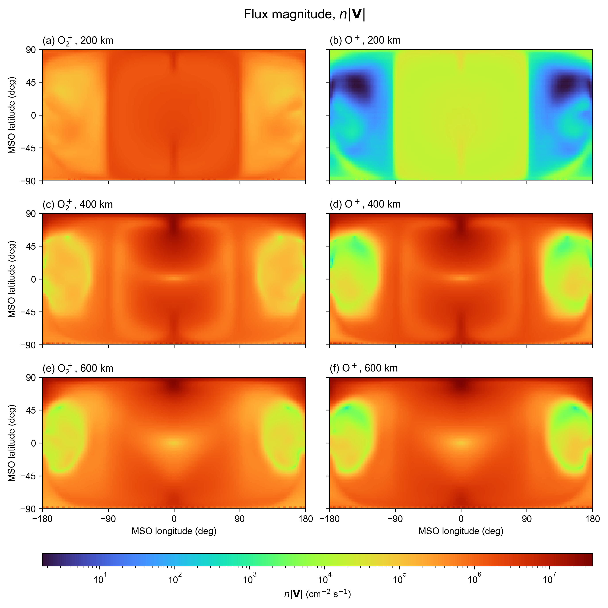

# Bulk-speed flux at 200, 400 and 600 km



Rows show 200, 400 and 600 km altitude; columns show O₂⁺ and O⁺. The plotted quantity is `F = n*norm(U_bulk)`, in cm⁻² s⁻¹. It includes both radial velocity signs and uses the full Cartesian bulk speed. The source sampler uses the same definition in SI, m⁻² s⁻¹, before multiplication by patch area. It does not use the speed of individual thermal samples.

All six panels share one turbo logarithmic scale covering every unmasked positive value, approximately 1.718 to 3.78244×10⁷ cm⁻² s⁻¹. Nonpositive values cannot be displayed on a log scale. The documented suspect south-pole row is masked in grey. There is no smoothing or percentile clipping. Non-mathematical text uses Arial.

## Data and coordinate conventions

The input is `data/mars_fields_spherical_from_dat.vts`, using the O₂⁺ and O⁺ moment fields mapped by `MarsTP.load_mhd_moments`. Density is in m⁻³ and Cartesian velocity in m/s. Density and each velocity component are interpolated separately before taking the speed and converting flux by division by 10⁴.

The figure follows the existing background-map convention: longitude `atan2(y,x)` and latitude `asin(z/r)`, labeled MSO, rather than planetographic longitude/latitude. These are native model-axis angles; independent MSO/MSE provenance of the original MHD run is not established by the VTK file. Mars radius is 3390 km. The 2° grid has 91 latitudes and 181 longitudes, including the duplicated plotting seam.

These maps preserve the existing `load_mhd_moments` reconstructed logarithmic radial axis. The forward shell runner separately validates the stored VTK points and uses their actual radii. Consequently the maps illustrate the flux definition but are not an exact table of the shell runner's source-cell rates. At the 200 km boundary `ionosphere_properties` offsets queries 10⁻⁸ m into its interpolation domain to avoid roundoff. The native source cells use angular area centroids, not this plotting grid.

## Reproduction

Regenerate the figure from the local VTK file using the Julia sampler and Python plotting script. Run from the repository root; the plotting script requires `--csv`. The following writes UTF-8 CSV without shell-dependent encoding:

```python
import subprocess
from pathlib import Path
folder = Path('examples/forward_tracing/monte_carlo_forward_tracing')
with open('bulk_speed_flux_samples.csv', 'w', encoding='utf-8') as output:
    subprocess.run(['julia', '--project=.', str(folder/'sample_bulk_speed_flux_maps.jl'),
                    '200', '400', '600'], stdout=output, check=True)
subprocess.run(['python', str(folder/'plot_bulk_speed_flux_maps.py'),
                '--csv', 'bulk_speed_flux_samples.csv', '--output', 'bulk_speed_flux_resampled.png'], check=True)
```

The Julia sampler also preserves radial velocity and radial flux diagnostics, but this figure uses only `n*norm(U_bulk)`. NumPy, Matplotlib and Arial are required for plotting; no additional package installation is performed by these scripts.

## Relation to Monte Carlo weights

With importance ratio `w_i = g(v_i)/g_s(v_i)`, the default shell source is `Q_i = F_cell A_cell w_i/sum_cell(w)`. Thus each cell's rates sum to `n*norm(U_bulk)*A_cell`, with no test of bulk or sampled radial velocity sign. The Maxwellian is untruncated. This is a prescribed injection model, not a signed radial or thermal half-space crossing flux. O⁺ in this figure is a comparison; the example still traces O₂⁺.

The source sphere remains an absorbing boundary: inward launches retain their source rate but terminate at time zero as `inner`. Existing stored trajectory/PSD illustrations have not been rerun with this revised injection model. See the [main example](README.md) for the full weight definitions and reproduction commands.

Input SHA-256: `fa92bd82fe16975ad0d50f4e40ace344e9d41389d6024976d423e6126bc7a5c8`. The input is shared with the validated smoke run.
