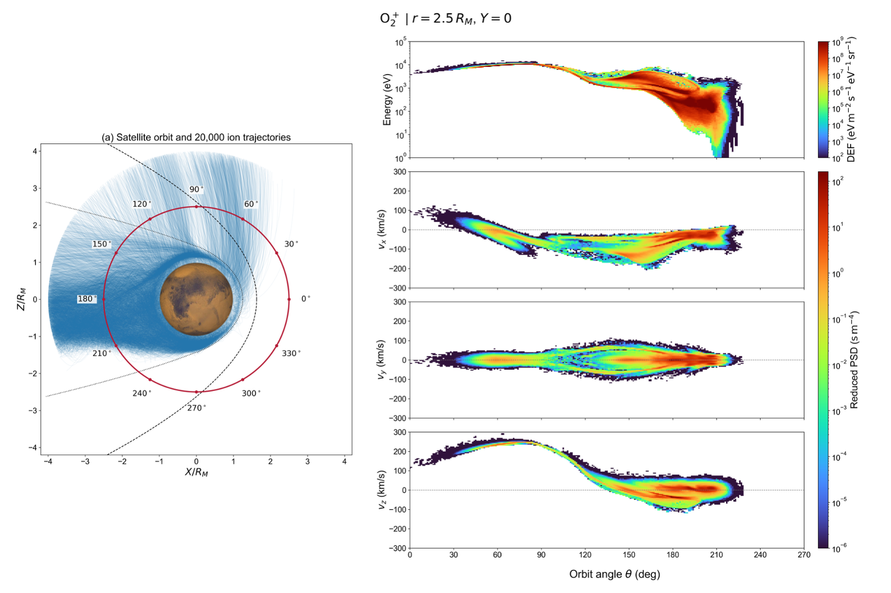

# O₂⁺ distributions along a prescribed satellite orbit



This Monte Carlo forward-tracing example combines an XZ projection of 20,000 O₂⁺ trajectories with a prescribed satellite orbit and the corresponding detector energy and velocity distributions along that orbit.

## Orbit geometry and trajectory panel

The red circular orbit lies in the **Y=0 plane at a Mars-centered radius of 2.5 R_M**, where R_M=3390 km. This is a radius, not an altitude: the orbit is 8475 km from the center and 5085 km above the adopted surface. The orbit angle is defined by

$$
\mathbf{x}(\theta)=2.5R_M(\cos\theta,\,0,\,\sin\theta).
$$

Thus 0° points along +X, 90° along +Z, 180° along −X and 270° along −Z. The left panel labels the orbit every 30°. Blue curves show the ion trajectories projected onto XZ. Dashed and dotted black curves indicate the bow shock (BS) and magnetic pileup boundary (MPB).

The red curve specifies detector locations in the steady-state model. The horizontal coordinate of the distribution panels is orbit angle, not elapsed satellite time. No spacecraft speed or orbital period is assigned by this figure.

## Energy distribution

The upper-right panel shows the 4π direction-averaged differential energy flux (DEF) of O₂⁺ versus orbit angle and energy. Both energy and the turbo color scale are logarithmic. DEF retains units of **eV/(m² s eV sr)**.

For steady particle-rate weights Q_i and detector volume V_det, the energy-bin estimator is

$$
\mathrm{DEF}_k(\theta)=
\frac{\sum_i Q_i\int_{\mathbf{x}_i(t)\in V_{\mathrm{det}}(\theta),\,E_i(t)\in k}E_i(t)|\mathbf{v}_i(t)|\,dt}
{4\pi V_{\mathrm{det}}\Delta E_k}.
$$

Energy is in eV and speed in m/s. Dividing by 4π gives a directional average without requiring isotropy. See [detector_omni_def](detector_omni_def.md) for the implementation and interfaces.

## One-dimensional reduced velocity distributions

The remaining three right-hand panels show the distributions in v_x, v_y and v_z, respectively. Each is obtained by integrating the three-dimensional detector PSD over the other two velocity components:

$$
f_x(v_x)=\iint f(v_x,v_y,v_z)\,dv_y\,dv_z,\qquad
f_y(v_y)=\iint f(v_x,v_y,v_z)\,dv_x\,dv_z,\qquad
f_z(v_z)=\iint f(v_x,v_y,v_z)\,dv_x\,dv_y.
$$

These are **one-dimensional reduced distributions**, not slices at zero transverse velocity. They share a logarithmic turbo color scale with units **s m⁻⁴**. Velocity axes are displayed in km/s; the integration widths and PSD normalization remain in SI. Grey horizontal lines mark zero velocity. Each reduced distribution integrates to the detector density within the sampled velocity domain.

For dense `forward_psd(...; option="3D")` output on its uniform velocity grid, the reductions can be formed as follows:

```julia
f = result.psd                         # dimensions: vx, vy, vz; s^3 m^-6
dvx, dvy, dvz = map(e -> first(diff(e)), result.velocity_edges_m_s)
fx = vec(sum(f; dims=(2,3))) .* dvy .* dvz
fy = vec(sum(f; dims=(1,3))) .* dvx .* dvz
fz = vec(sum(f; dims=(1,2))) .* dvx .* dvy
```

The displayed figure is supplied as an example image. Detector dimensions, bin edges, orbit-angle sampling, trajectory selection seed and plotting thresholds are not encoded in the image. Reproducing its numerical spectra requires the corresponding run configuration and saved trajectories; blank areas alone do not establish zero physical flux. The 20,000 curves specify the trajectory visualization count, not necessarily the particle count used for the distribution estimates.
