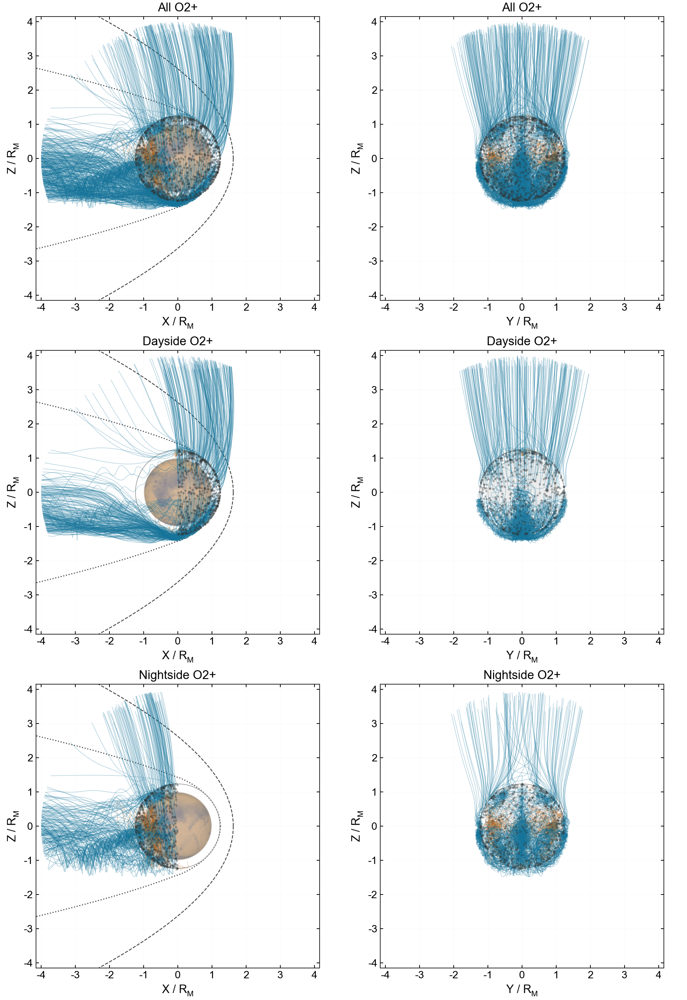

# XZ and YZ projections of O₂⁺ trajectories



## Layout

The three rows show all particles, dayside releases (`X0>0`) and nightside releases (`X0<=0`). Columns show XZ and YZ projections of the same three-dimensional paths. Group membership follows the release location and does not change after crossing the terminator.

All panels share scale and use Arial, with titles `All O2+`, `Dayside O2+` and `Nightside O2+`. There is no overall title or footer legend.

- Blue: outer boundary; orange: inner boundary; purple is available for time-limited paths.
- Dark points: release positions. Thin gray circles: projected release sphere.
- XZ: BS dashed curves, MPB dotted curves and the Mars image from `src/visualization`.
- YZ: geometric disk using `plot_mars(texture=False)`, without BS/MPB curves.
- Projected overlap with the disk does not imply impact. XZ includes every Y and YZ includes every X.

## Run

[plot_trajectories_xz_yz.py](plot_trajectories_xz_yz.py) calls [sphere_trajectories.jl](sphere_trajectories.jl).

```sh
python examples/forward_tracing/plot_trajectories_xz_yz.py
```

The default output is `examples/forward_tracing/images/trajectories_xz_yz_800km.png`. To preserve it, specify another path:

```powershell
$env:TRAJECTORY_PREVIEW = "$PWD/xz_yz_preview.png"
python examples/forward_tracing/plot_trajectories_xz_yz.py
```

Use four Julia threads, Julia on PATH, and Python with NumPy, Matplotlib and h5py. See [dependencies](README.md#environment-and-inputs). The local MHD input is not distributed on GitHub. Paths are passed through stdout rather than saved to disk, so each run reintegrates them.

## Parameters and recorded counts

The example releases 1000 stationary O₂⁺ particles at 800 km, with uniform solid-angle sampling and `Xoshiro(20260905)`. The step is 0.1 s, Rm=3390 km, boundaries are 200 km and 4 Rm, and the time limit is 20,000 s. See [model settings](README.md#initial-conditions-and-boundaries).

| Group | Count | Outer boundary | Inner boundary |
| --- | ---: | ---: | ---: |
| All | 1000 | 736 | 264 |
| Dayside | 500 | 453 | 47 |
| Nightside | 500 | 283 | 217 |

All particles reached a boundary in the original run; the longest flight was about 4148.53 s. The script checks group counts, finite states and final three-dimensional radii. This is an unweighted trajectory visualization, not a source-flux estimate or a complete convergence study.
